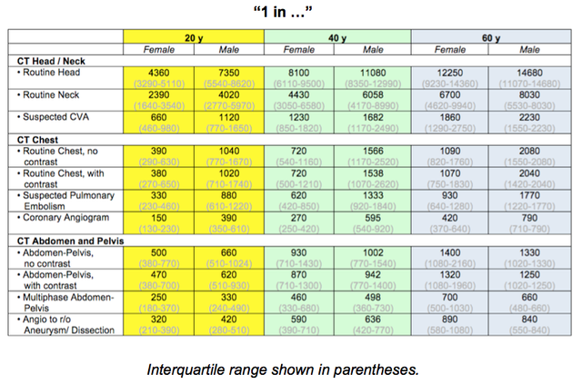

# Cancer Risk from CT

The lifetime attributable risk of 1 cancer from CT by age, gender, scanned area is:

## References

-   [Smith-Bindman R, Lipson J, Marcus R, Kim KP, Mahesh M, Gould R, Berrington de González A, Miglioretti DL. Radiation dose associated with common computed tomography examinations and the associated lifetime attributable risk of cancer. Arch Intern Med. 2009 Dec 14;169(22):2078-86. doi: 10.1001/archinternmed.2009.427.](https://www.ncbi.nlm.nih.gov/pubmed/?term=20008690)
-   [Pearce MS et al. Radiation exposure from CT scans in childhood and subsequent risk of leukaemia and brain tumours: a retrospective cohort study. Lancet. 2012 Aug 4;380(9840):499-505.](https://www.ncbi.nlm.nih.gov/pubmed?term=22681860)
