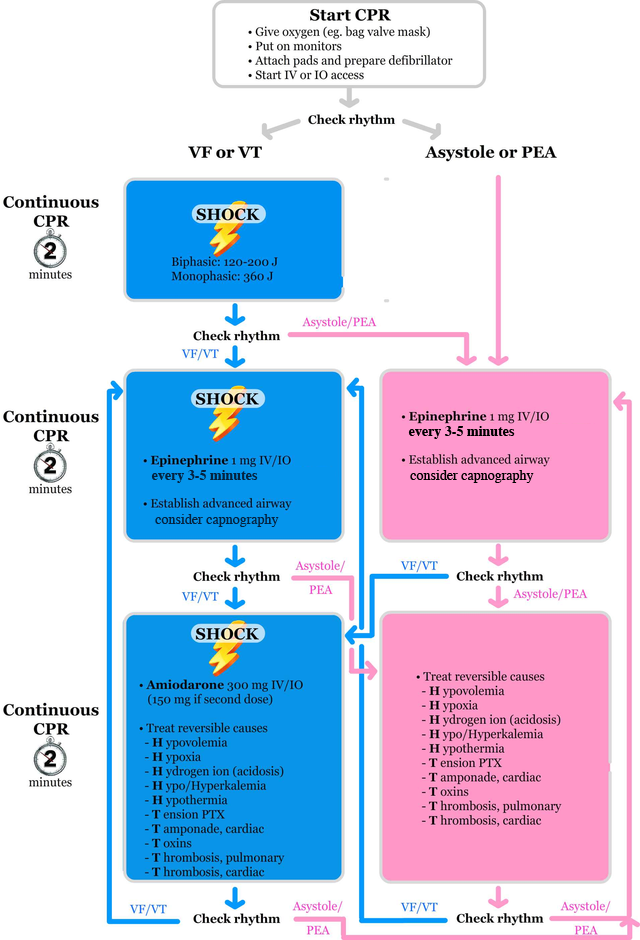

# ACLS 2015 Algorithm for Cardiac Arrest

## Tips

- **2 minutes** of continuous, uninterrupted CPR is key before rechecking the rhythm.
- Think about giving epinephrine every **OTHER** time you check the rhythm. This puts it at roughly a q4 minute dosing (recommended q3-5 minutes).
- Don't delay CPR when you recognize a cardiac arrest. That means do this first, and then work on giving oxygen, placing the patient on various monitors, setting up the defibrillator, and establishing IV/IO access. Hence, the C-A-B mnemonic (Circulation before Airway)
- Chest compressions should be "hard and fast" -- Depth of at least 2 inches and ≥ 100 compressions with a target PCO2 on the end-tidal capnography of ≥10 mm Hg.
- Use your mobile phone's timer to help alert you every time when 2 minutes is up.

## Additional reversible causes

**(not listed on ACLS AHA guidelines)**

- Hypoglycemia
- Trauma

## Return of Spontaneous Circulation

- Pulse and blood pressure
- PETCO2 abruptly sustained increase (typically ≥ 40 mm Hg)

## Post-Cardiac Arrest Care

**Ventillation & Oxygenation**: 

- Start at 10 breaths per minute
- Titrate to target PCO2 30-40 mm Hg
- Titrate FIO2 to minimum necessary to achieve SpO2 ≥ 94%

**Treat Hypotension**

- IV/IO bolus: 1-2L normal saline or lactate 
- Vasopressor infusion as needed:
  - Epinepherine IV 0.1-0.5 mcg/kg per minute
  - Dopamine IV 5-10 mcg/kg per minute
  - Norepihephrine IV 0.1-0.5 mcg/kg per minute

**Evaluate Need for Coronary Catheterization**

- 12-Lead ECG STEMI or high suspicion of acute myocardial infarction? Proceed to coronary reperfusion.

**Targeted Temperature Management**

- If no meaningful response to verbal stimuli, maintain a constant temperature between 32°C and 36°C 

## Patwari Academy video tutorials

- [ACLS: Airway](https://www.aliem.com/2012/patwari-academy-videos-acls-and-airway/)

## References

- Neumar RW, Shuster M, Callaway CW, et al. Part 1: Executive Summary: 2015 American Heart Association Guidelines Update for Cardiopulmonary Resuscitation and Emergency Cardiovascular Care. Circulation. 2015;132(18 Suppl 2):S315-67. [PubMed](https://www.ncbi.nlm.nih.gov/pubmed/26472989)
