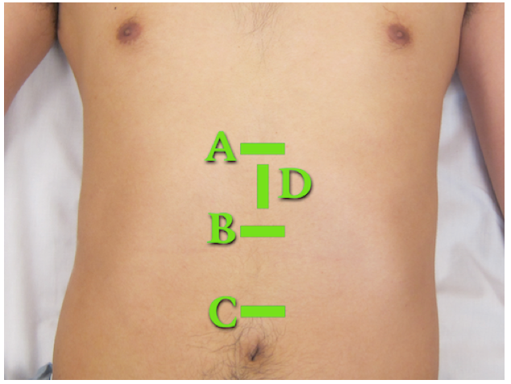
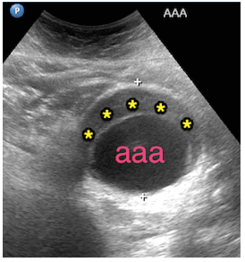
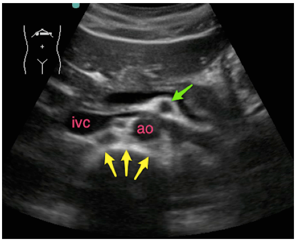

---

title: 'Ultrasound: Focused Abdominal Aorta Ultrasound'
authors:
    - Victoria Koskenoja, MD
    - Heidi Kimberly, MD
    - Mike Stone, MD
created: 2014/09/13
updates:
categories:
    - Ultrasound
    - Radiology
    - Cardiovascular
---

# Ultrasound: Focused Abdominal Aorta

**Goal**
- Evaluate for abdominal aortic aneurysm (AAA)

**Transducer** 
- Low-frequency curvilinear (low-frequency phased if curvilinear unavailable)

**Windows** 
- The goal is to image the entire abdominal aorta from diaphragm (subxiphoid area) to bifurcation into iliac arteries (near the umbilicus). Images should be obtained in both **transverse** and **longitudinal** planes. The specific areas include:

Figure 1: Transducer positions for aortic scan. Proximal (A), Mid-aorta (B), Distal (C), and Longitudinal (D)

## Normal Reference Measurements

- Aorta from outer wall to outer wall &lt;3 cm
- Iliac vessels at bifurcation, outer wall to outer wall &lt;1.5 cm

**Signs of AAA:** 
- Enlarged aorta >3 cm
- Most AAA’s are fusiform and are infrarenal.
- The SMA is a useful landmark as it is in close proximity to the renal arteries, which are often difficult to identify. 
- AAAs often contain a mural thrombus that MUST be included in your measurement of the aneurysm.

Figure 2: Aortic aneurysm (aaa) measuring 6 cm wide with mural thrombus (asterisks).

## Transverse View

Transducer orientation is transverse with marker towards the patient’s right

1. Proximal – Midline just below the xiphoid process
2. Mid-Aorta – Midline between xiphoid process and umbilicus
3. Distal - Midline near level of umbilicus

Figure 3: Proximal aorta transverse view demonstrating the inferior vena cava (ivc), the aorta (ao), the celiac trunk (red arrows) branching into the common hepatic artery (green arrow) and splenic artery (yellow arrow). Known as “seagull sign”.

Figure 4: Proximal aorta transverse view caudal to Figure 3. Note inferior vena cava (ivc), aorta (ao), anterior cortex of vertebral body (yellow arrows) and superior mesenteric artery (green arrow) with surrounding hyperechoic fat (“clock mantle” sign).

## Longitudinal View

Transducer orientation is sagittal with marker towards the patient’s head 

Figure 5: Proximal aorta longitudinal view demonstrating the abdominal aorta (red arrows), the celiac trunk (yellow arrow) and the superior mesenteric artery (green arrow). Note that the abdominal aorta becomes more superficial as it descends into the abdomen, following the natural curvature of the spinal column.

## Struggling with the Exam?

### Can’t find the aorta?

- Use plenty of compression to displace bowel gas – it’s remarkable how much pressure patients tolerate and how much it will improve your view. The vertebral shadow can be used as a landmark as the aorta should be just anterior to the vertebrae. Increase the depth setting until the vertebral shadow is seen. You can start in any segment and follow the aorta proximally or distally. You may also roll the patient on his/her left side or use the liver as a window to find the proximal aorta by using a coronal RUQ view (like a FAST view) with increased depth.

### Not sure if you are scanning proximal vs mid-aortic site?

- The proximal view should include the celiac trunk and/or the SMA branching from aorta. Both arise anteriorly with the celiac immediately splitting (seagull sign) and the SMA surrounded by bright echogenic fat (Fig 3-4). The mid-aorta does not have these landmarks.

## Common Errors

- Measuring the lumen instead of the entire vessel.  Abdominal aortic aneurysms often have mural thrombus so be careful to measure outer wall to outer wall to avoid incorrect measurements. 

- Mistaking IVC for aorta. The aorta is on the patient’s left (screen right), has a thicker more echogenic wall, and is round in a transverse view while the IVC is often teardrop shaped.

- Failing to visualize the entire aorta – you must see it from diaphragm to bifurcation to exclude the presence of an aneurysm.  

- Relying on ultrasound for the diagnosis of aortic dissection. While a dissection flap can be visualized and should prompt immediate action, failure to visualize a flap by ultrasound does not exclude aortic dissection.

## References

- Tayal VS, Graf CD, Gibbs MA. Prospective study of accuracy and outcome of emergency ultrasound for abdominal aortic aneurysm over two years. Acad Emerg Med. 2003;10(8):867-71. [[PubMed](http://www.ncbi.nlm.nih.gov/pubmed/12896888)]
- Kuhn M, Bonnin RL, Davey MJ, Rowland JL, Langlois SL. Emergency department ultrasound scanning for abdominal aortic aneurysm: accessible, accurate, and advantageous. Ann Emerg Med. 2000;36(3):219-23. [[PubMed](http://www.ncbi.nlm.nih.gov/pubmed/10969223)]
- Taylor RA, Oliva I, Van tonder R, Elefteriades J, Dziura J, Moore CL. Point-of-care focused cardiac ultrasound for the assessment of thoracic aortic dimensions, dilation, and aneurysmal disease. Acad Emerg Med. 2012;19(2):244-7. [[PubMed](http://www.ncbi.nlm.nih.gov/pubmed/22288871)]
