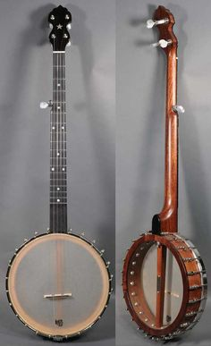
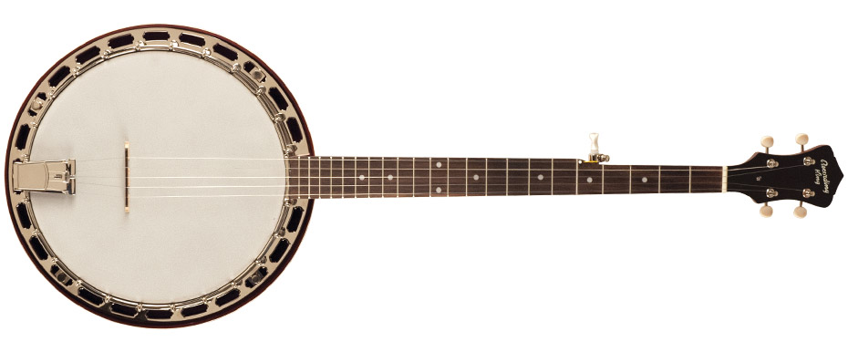
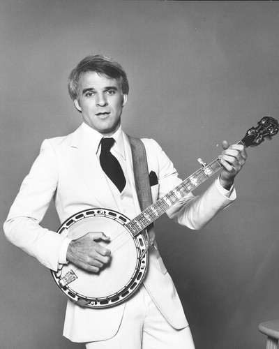

---

title: Banjo Music
authors:
    - Jeremy Voros, MD
created: 2017/04/25
updates:
categories:
    - Music
    - evidence based medicine
 
---

# Banjo Music

A card about banjos. Updated in MacDown.

## Styles of Banjo Play

- Scruggs or three-finger style
- Clawhammer or frailing style

## Kinds of Banjos

**Open back banjo**

**Resonator banjo**

## Famous People Who Also Play Banjo

- Steve Martin.

## References

- [a banjo reference](http://www.pubmed.com)