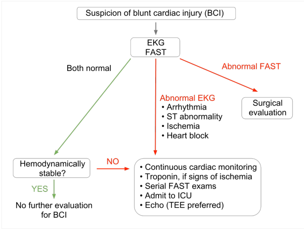

---

title: Blunt Cardiac Injury
authors:
    - Michelle Lin, MD
created: 2012/06/29
updates: null
categories:
    - Trauma
    - Cardiovascular
---

# Blunt Cardiac Injury

_Definition:_ Encompasses wide spectrum of clinical injuries, ranging from asymptomatic myocardial bruise to cardiac rupture/death 

No gold standard 

**Pearls:**

- Causes 20% of all deaths due to motor vehicle collisions
- Most commonly injured chamber: Right ventricle (most anterior in chest) 

**Clinical tips:**

- Suspect in anyone with significant blunt, deceleration, or crush trauma to chest
- Consider BCI in hemodynamically unstable patients without alternative cause
- Troponin I and T lack adequate sensitivity as screening test  

Suggested algorithm, based on available evidence:

## References

- Bernardin B, Troquet JM. Initial management and resuscitation of severe chest trauma. EM Clinics of North Am. 2012;30:377-400. [PubMed](http://www.ncbi.nlm.nih.gov/pubmed/?term=22487111)
