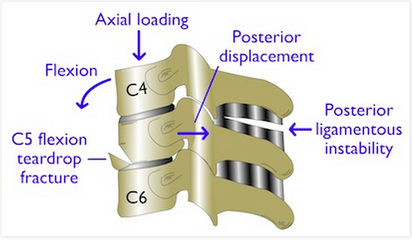

---

title: 'C3-C7 Spine Fractures'
authors:
    - 'Michelle Lin, MD'
created: 2010/10/01
updates: null
categories:
    - Orthopedics
drugs: null

---

# Fractures, C3-C7 Spine

## Articular mass fractures

| Mechanism   | Stable      |
|-------------|-------------|
| Flexion-rotation   | Yes  |

- Associated with transverse process and vertebral body fractures
- Uncommon

## Burst fractures

| Mechanism   | Stable      |
|-------------|-------------|
| Axial compression   | Yes/No |

- Compressive fracture of the anterior and posterior vertebral body
- *Complication*: Spinal cord injury because of retropulsed vertebral body fragment (especially anterior cord syndrome)

## Spinous process fracture (“Clay Shoveler’s" fracture)

| Mechanism   | Stable      |
|-------------|-------------|
| Flexion   | Yes |

- Spinous process fracture from forceful neck flexion
- Most commonly occurs in lower cervical levels (C7)
- Not associated with neurologic injury

## Extension teardrop fracture

| Mechanism   | Stable      |
|-------------|-------------|
| Extension   | No |

- See Fracture, C1 and C2 spine topic
- Most commonly occurs at C2

## Facet dislocation, bilateral

| Mechanism   | Stable      |
|-------------|-------------|
| Flexion   | No |

- Significant anterior displacement (&gt;50%) of spine when bilateral inferior facets displace anterior to the superior facets below
- At risk for injuring anterior and posterior longitudinal ligament, disk, vertebral arteries, and spinal cord

## Flexion dislocation, unilateral

| Mechanism   | Stable      |
|-------------|-------------|
| Flexion-rotation  | Yes |

- Usually causes 25-50% anterior displacement of spine
- Complication: Vertebral artery injury (CT angiography recommended)

## Flexion teardrop Fracture

| Mechanism   | Stable      |
|-------------|-------------|
| Flexion and axial load  | No |

- Fracture and anterior displacement of anteroinferior vertebral body (appears similar to extension teardrop fracture, except much more unstable)
- Rupture of both anterior &amp; posteior ligamentous complexes&nbsp;
- Unique findings for flexion (versus extension)&nbsp;teardrop fx: Same-level fxs, displacement of posterior structures
- Regarded as ONE OF THE MOST UNSTABLE FX's in the lower cervical spine, because involves both columns 
- Usually occurs at C5 or C6

## Subluxation, anterior

| Mechanism   | Stable      |
|-------------|-------------|
| Flexion | No |

- Ruptured posterior ligamentous complex, such that anterior and posterior vertebral lines are disrupted
- Complication: vertebral artery dissection (CT angiography recommended)
- May only be evident during flexion views by conventional xray; the interspinous distance widens and the vertebral body subluxes anteriorly

## Transverse Process Fracture

| Mechanism   | Stable      |
|-------------|-------------|
| Lateral flexion | Yes |

- *Complication*: Vertebral artery injury, because travels within the transverse foramina (CT angio recommended)
- *Complication*: Cervical radiculopathy and brachial plexus injuries associated in 10% of cases

## Wedge Fracture

| Mechanism   | Stable      |
|-------------|-------------|
| Flexion | Yes |

- Compression fracture of only the anterosuperior vertebral body endplate
- Disruption of anterior vertebral line

| **Injury (Mechanism)**                                                                                           | **Stable** |
|------------------------------------------------------------------------------------------------------------------|------------|
| Articular mass fx (Flexion-rotation) | Yes        |
| Burst fx (Axial compression) | Yes/No     |
| Spinous process fx (Flexion) | Yes        |
| Extension teardrop fx (Extension) | No         |
| Facet dislocation, bilateral (Flexion) | No         |
| Flex dislocation, unilateral (Flexion-rotation) | Yes        |
| Flexion teardrop fx (Flexion and axial load) | No         |
| Subluxation, anterior (Flexion) | No         |
| Transverse process fx (Lateral flexion) | Yes        |
| Wedge fx (Flexion) | Yes        |

## References

-   [Lin M and Mahadevan S. “Spine and Spinal Cord Injuries” in Adams J et al (eds), Emergency Medicine. New York: Elsevier, 2007](None)
