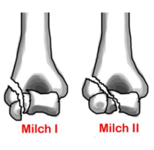

---

title: Elbow Injuries - Condyle Fracture Lateral
authors:
   - Melody Glenn, MD
   - Andrew Little, DO
   - Mary Haas, MD
created: 2016/12/12
updates:
categories:
   - Peer Reviewed
   - Orthopedics

---

# Elbow Injuries: Condyle Fracture Lateral

## Xray Views

Elbow XR: AP, lateral, internal oblique

## Acute Management

Long-arm posterior splint with elbow at 90° flexion and forearm supination

Consider a long arm cast instead

Operative indications:
- &gt;2 mm displacement
- Any joint incongruity
- Fracture non-union

## Follow-up Timing

Non-operative: Follow up in 5-7 days

Operative: Follow up in 2-3 days

## Notes

Milch Classification:
- Type I: Fx line is lateral to trochlear grove
- Type II: Fx line into trochlear groove

Complications: Ulnar nerve injury and avascular necrosis
- Usually in children 5-10 years old
- Majority will require operative stabilization

## References

- Wheeless’ Textbook of Orthopaedics.  [[Source](http://Wheelessonline.com)]
- Orthobullets.  [[Source](http://OrthoBullets.com)]
- Radiopaedia.  [[Source](http://Radiopaedia.org)]
- General Guidelines For Management for Orthopedic Injuries card by the Nationwide Children’s Hospital, Dept of Orthopedics.
