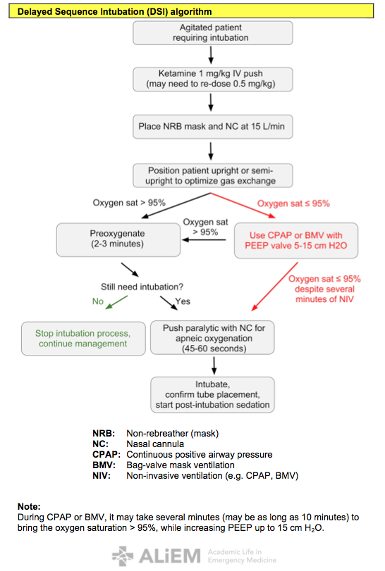

# Delayed Sequence Intubation (DSI)

**General Concepts**

-   DSI is procedural sedation/dissociation where the procedure is preoxygenation
-   Breaks up the sequence of RSI to preoxygenate prior to paralysis—prolongs safe apnea duration and decreases risk of gastric insufflation or aspiration
-   Maintains patient’s spontaneous respirations and reflexes

## Candidates for DSI

-   Agitated due to EtOH, head injury, or psychosis, but with normal lungs
-   Agitated, but with lungs capable of being oxygenated on non-rebreather (NRB) mask: hypoxic due to COPD, pneumonia, ARDS
-   Agitated, but require non invasive positive pressure ventilation (NIPPV) to preoxygenate
-   Unobtainable or unacceptable vital signs due to any of the above
-   Need to perform a procedure that the patient is not tolerating prior to intubation (e.g. NGT placement prior to intubation of GI bleeder)

## Ketamine

-   **Dose:** 1 mg/kg IV push (may need to re-dose 0.5 mg/kg to maintain dissociation)
-   **Pros:** 30 sec onset, achieves dissociative state, maintains spontaneous respirations and airway reflexes, maintains hemodynamic stability
-   **Cons**: May increase intracranial pressure in patients with high MAP, may cause laryngospasm, use with caution in patients with CAD, HTN, or tachycardia

## Equipment and Troubleshooting

-   Respiratory therapist
-   Nasal cannula (NC)
-   Non-rebreather (NRB) mask
-   Bag valve mask (BVM) with PEEP valve
-   2 O2 flow meters (NRB or BVM, NC)
-   Ventilator with NIPPV settings
-   Non-vented mask with straps for CPAP
-   End tidal CO2 monitor

## Pearls: DSI ≠ NIV 

-   Preoxygenation may be achieved with NC, NRB mask, **OR** NIPPV, depending on the patient’s needs
-   If your patient is not agitated, NIV may be sufficient without the need for sedation/dissociation
-   Intubation may be avoided if adequate dissociation and oxygenation is attained

## Delayed Sequence Intubation (DSI) algorithm

**Note:** During CPAP or BMV, it may take several minutes (may be as long as 10 minutes) to bring the oxygen saturation &gt; 95%, while increasing PEEP up to 15 cm H2O.

## References

-   [Weingart SD. Preoxygenation, reoxygenation, and delayed sequence intubation in the emergency department.J Emerg Med. 2011 Jun;40(6):661-7. doi: 10.1016/j.jemermed.2010.02.014. Epub 2010 Apr 8.](https://www.ncbi.nlm.nih.gov/pubmed/?term=20378297)
-   [Weingart SD, Levitan RM. Preoxygenation and prevention of desaturation during emergency airway management. Ann Emerg Med. 2012 Mar;59(3):165-75.e1. doi: 10.1016/j.annemergmed.2011.10.002. Epub 2011 Nov 3](https://www.ncbi.nlm.nih.gov/pubmed/?term=22050948)
-   [Sehdev RS, Symmons DA, Kindl K. Ketamine for rapid sequence induction in patients with head injury in the emergency department. Emerg Med Australas. 2006 Feb;18(1):37-44.](https://www.ncbi.nlm.nih.gov/pubmed/?term=16454773)
-   [Bourgoin A, Albanèse J, Wereszczynski N, Charbit M, Vialet R, Martin C.Safety of sedation with ketamine in severe head injury patients: comparison with sufentanil.Crit Care Med. 2003 Mar;31(3):711-7.](https://www.ncbi.nlm.nih.gov/pubmed/?term=12626974)
-   [Weingart SD, Trueger NS, Wong N, Scofi J, Singh N, Rudolph SS. Delayed Sequence Intubation: A Prospective Observational Study. Ann Emerg Med. 2015 Apr;65(4):349-55. doi: 10.1016/j.annemergmed.2014.09.025. Epub 2014 Oct 23.](https://www.ncbi.nlm.nih.gov/pubmed/25447559) 

