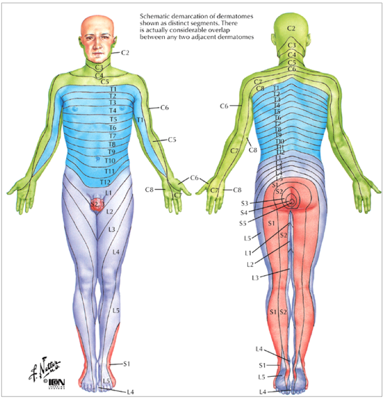

---

title: Dermatomes and Myotomal Maps
authors:
    - Michelle Lin, MD
created: 2013/05/26
updates: null
categories:
    - Orthopedics

---

# Dermatomes and Myotomal Maps

## Testing Motor Function by Level

| **Nerve Level** | ** Motor Function** |
| *---* | --- |
| C1-C4 | Spontaneous breathing |
| C5 | Shoulder abduction (deltoid) |
| C6 | Wrist extension (carpi radialis longus and brevis) |
| C7 | Elbow extension (triceps) |
| C8 | Finger flexion (flexor digitorum superficialis/profundis, lumbricals) |
| T1 |  Finger adduction & abduction (dorsal/palmar interossei, abductor digiti quinti) |
| T1-T12 | Intercostal and abdominal muscles |
| T12-L3 | Hip flexion (iliopsoas) |
| L2-L4 | Hip flexion, knee extension (quadriceps), hip adduction
| L4 | Ankle dorsiflexion and inversion (anterior tibialis) |
| L5 | Big toe extension (ext hallucis longus), heel walk (ext digitorum), hip abduction (gluteus medius) |
| S1 | Ankle plantarflexion and eversion (peroneus longus), toe walk (peroneus brevis), hip extension (gluteus maximus) |
| S2-S4 | Rectal sphincter tone |
