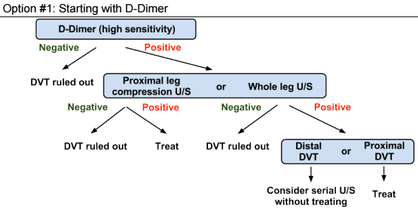
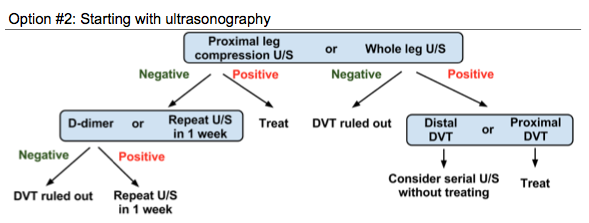

---

title: 'DVT of the Leg - ACCP Guidelines'
authors:
    - 'Michelle Lin, MD'
created: 2013/01/24
updates: null
categories:
    - Cardiovascular
    - EBM
drugs: null

---

# Deep Vein Thrombosis (DVT) of Leg: 2012 ACCP Guidelines

**Wells Clinical Prediction Criteria for DVT (Determine pretest probability)**

|                                                    |     |
|----------------------------------------------------|-----|
| Active malignancy                                  | +1  |
| Major surgery within 4 weeks or bedridden &gt; 3 days   | +1  |
| Asymmetric calf swelling &gt; 3 cm in affected leg | +1  |
| Collateral, non-varicose superficial veins         | +1  |
| Entire leg swelling                                | +1  |
| Localized tenderness along deep venous system      | +1  |
| Pitting edema greater in symptomatic leg           | +1  |
| Paralysis, paresis, or recent leg immobilization   | +1  |
| Previous DVT                                       | +1  |
| Alternative diagnosis equally or more likely       | -2  |

**Apply Wells score** to the [2012 ACCP Evidence-Based Clinical Practice Guideline](http://www.ncbi.nlm.nih.gov/pubmed/22315267) as summarized below.

## Wells score &lt; 1 (LOW pretest probability, 5%) 

## Wells Score 1-2 (Moderate pretest probability, 17%)  

***Two options:*** start with D-dimer or ultrasound 

***Note:*** If significant comorbidities exist that may cause D-Dimer elevation, start with ultrasound as initial test. If ultrasound is unfeasible (excessive tissue or leg casting), use venography.

## Wells score &gt; 2 (High pretest probability, 53%) 

Do NOT begin with D-Dimer. Follow Option \#2 from Moderate Pretest Probability.

## Pregnant patients 

***Note:*** If clinical suspicion of iliac vein thrombosis (entire leg swelling), proceed to iliac vein U/S or venography, if initial proximal leg U/S is negative.

## References

-   [Bates SM, Jaeschke R, Stevens SM, Goodacre S, Wells PS, Stevenson MD, Kearon C, Schunemann HJ, Crowther M, Pauker SG, Makdissi R, Guyatt GH; American College of Chest Physicians.Diagnosis of DVT: Antithrombotic Therapy and Prevention of Thrombosis, 9th ed: American College of Chest Physicians Evidence-Based Clinical Practice Guidelines. Chest. 2012 Feb;141(2 Suppl):e351S-418S.](http://www.ncbi.nlm.nih.gov/pubmed/22315267)
