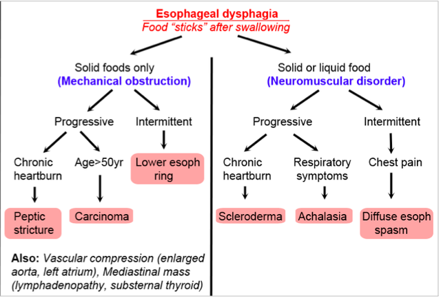

---

title: Dysphagia
authors:
    - Michelle Lin, MD
created: 2010/02/03
updates:
categories:
    - Gastroenterology
---

# Dysphagia

## Oropharyngeal Dysphagia

**Symptoms:**

- Difficulty initiating swallowing
- May include coughing, choking or nasal regurgitation

**Mechanical obstruction**

- Tumor, inflammatory masses
- Trauma/ surgical resection
- Zenker's diverticulum
- Esophageal webs
- Extrinsic structural lesions
- Anterior mediastinal masses
- Cervical spondylosis

**Neuromuscular disorder**

- CVA (common cause)
- Parkinson's disease
- Brain stem tumors 
- Degenerative disease (ALS, multiple sclerosis, Hungtington's)
- Post-infectious (polio, syphilis) 
- Peripheral neuropathy
- Myasthenia gravis
- Myopathies
- Cricopharyngeal disease 
- Achalasia

## Esophageal dysphagia

## Approach to dysphagia

1. Determine first if patienthas oropharyngeal versus esophageal dysphagia. 
2. Determine ifmechanical (problem issolid foods only) versus neuromuscular(problem with liquids and solids) is more likely.

**Tip:**

-  Medications can causedysphagia fromesophageal mucosalinjury or reduced lower esophageal sphinctertone.
-  CVA is most commoncause of oropharyngealdysphagia

## Workup for dysphagia

- Endoscopy
- Barium swallow
- Consider esophageal pH probe, manometry 

## References

- Spieker MR.Evaluating dysphagia. Am Fam Physician. 2000 Jun 15;61(12):3639-48. [PubMed](https://www.ncbi.nlm.nih.gov/pubmed/?term=10892635)
