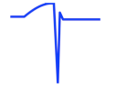
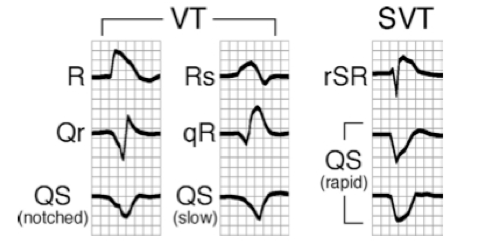

---

title: Lead aVR
authors:
    - Michelle Lin, MD
created: 2011/11/18
updates: null
categories:
    - Cardiovascular
    - ECG
---

# ECG: Lead aVR

**Lead avR can provide some unique insight into 5 different conditions:**

1. Acute MI
2. Pericarditis
3. Tricyclic antidepressants (TCA) and TCA-like overdose
4. AVRT in narrow complex tachycardias
5. Differentiating VT from SVT with aberrancy in wide complex tachycardias

## Acute myocardial infarction

**ST Elevation >1.5 mm in aVR**

- Suggests left main coronary artery (LMCA), left anterior descending (LAD), or 3-vessel coronary disease
- LMCA occlusion has a high mortality and often refractory to thrombolytics.
- **aVR ST elevation in ACS patients:** Independent predictor of recurrent ischemic events in-hospital, heart failure, and death 

## Pericarditis

**PR elevation in aVR**

Suggests subepicardial atrial injury from pericardial inflammation

**Multilead ST elevation:** 

- Differential diagnosis includes ACS vs pericarditis 
- Concurrent PR elevation in aVR suggests pericarditis instead of ACS. 

## Tricyclic antidepressant (TCA) & TCA-like overdose

**Prominent R wave in aVR**

- Classic ECG findings of TCA overdose:
  - Sinus tachycardia
  - Widened QRS and QTc interval
  - Right axis deviation 130-170 degrees
  - Prominent terminal R wave in aVR
- Predictor of arrhythmia ([Buckley et al. Crit Care, 2003](http://www.ncbi.nlm.nih.gov/pubmed/12974977)):
  - R/S ratio in aVR >0.7 (PPV 46%, NPV 95%)

## AVRT in Wolff-Parkinson-White (WPW)

**Atroventricular reentry tachycardia**

- ST elevation in aVR in narrow complex tachycardia
- Narrow complex tachycardia ddx:
  - AV node reentry tachycardia 
  - AV reentry tachycardia
  - Atrial tachycardia
- ST elevation in aVR suggestive more of AVRT in WPW (sensitivity 71%, specificity 70%)

## Vereckei criteria: VT versus SVT in wide complex tachycardia

**Vereckei criteria:** 

- Asks 4 questions. 
- More sensitive and specific to detect ventricular tachycardia (VT) than Brugada criteria.
- **Criteria looks ONLY at lead aVR** (if answer is yes, then VT):

1. Is there an initial R wave?
2. Is there a r or q wave >40 msec? (>1 small box width)
3. Is there a notch on the descending limb of a negative QRS complex?
4. Measure the voltage change in the first (vi) and last 40 msec (vt). Is vi / vt &lt;1?

| Criteria | Sensitivity | Specificity | PPV | NPV |
| -------- | :---------: | :---------: | :-: | :-: |
| Brugada  |     89%     |     73%     | 92% | 67% |
| Verecki  |     97%     |     75%     | 93% | 87% |

([Vereckei et al, Heart Rhythm 2008](http://www.ncbi.nlm.nih.gov/pubmed/18180024))

## References

- Kireyev D et al.Clinical utility of aVR-The neglected electrocardiographic lead. Ann Noninvasive Electrocardiol. 2010;15(2):175-80. [PubMed](http://www.ncbi.nlm.nih.gov/pubmed/20522059)
- Riera AR et al.Clinical value of lead aVR. Ann Noninvasive Electrocardiol. 2011 Jul;16(3):295-302. [PubMed](http://www.ncbi.nlm.nih.gov/pubmed/21762258)
- Vereckei A, Duray G, Szénási G, Altemose GT, Miller JM. New algorithm using only lead aVR for differential diagnosis of wide QRS complex tachycardia. Heart Rhythm. 2008 Jan;5(1):89-98. doi: 10.1016/j.hrthm.2007.09.020. Epub 2007 Sep 20. [PubMed](http://www.ncbi.nlm.nih.gov/pubmed/18180024)
- Buckley NA et. al.The limited utility of electrocardiography variables used to predict arrhythmia in psychotropic drug overdose.Crit Care. 2003 Oct;7(5):R101-7. Epub 2003 Aug 18. [PubMed](http://www.ncbi.nlm.nih.gov/pubmed/12974977)
- Williamson K et al. Electrocardiographic applications of lead aVR. Am J Emerg Med. 2006 Nov;24(7):864-74. [PubMed](http://www.ncbi.nlm.nih.gov/pubmed/17098112)
