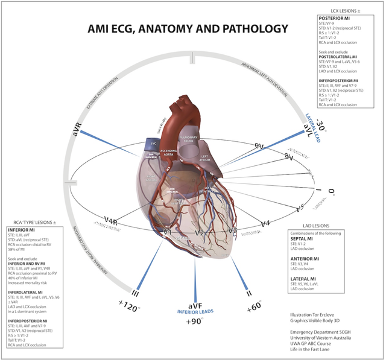

---

title: 'ECG Geography for AMI'
authors:
    - 'Michelle Lin, MD'
created: 2011/04/08
updates: null
categories:
    - Cardiovascular
    - ECG
drugs: null

---

# ECG: Geography for AMI

## References

-   [Illustration by: Dr. Tor Ercleve Emergency Department Sir Charles Gairdner Hospital University of Western Australia Graphics Visible Body 3D](None)
