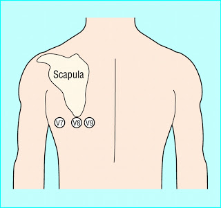
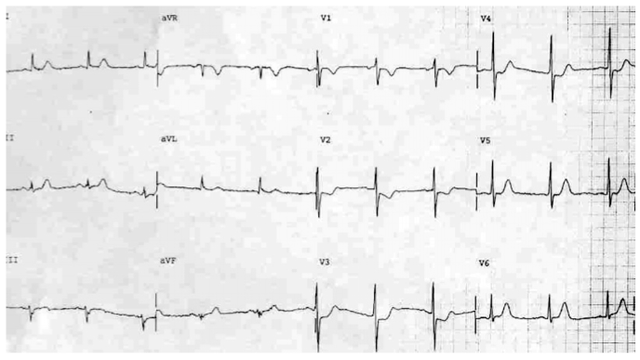

---

title: ECG Right and Posterior Leads
authors:
    - Michelle Lin, MD
created: 2011/03/11
updates: null
categories:
    - Cardiovascular
    - ECG
---

# ECG: Right and Posterior Leads

## Right Sided ECG Leads

****

Right sided ECG leads (V1R-V6R) are positioned in a mirror image fashion to the standard 12-lead precordial leads.

- **Purpose:** To detect right ventricular (RV) infarcts
- RV infarcts usually associated with inferior wall AMI
- **Indications**: 2004 ACC/AHA guidelines state to get a **right-sided ECG** in setting of **inferior AMI** (ST elevation in II, III, AVF)

Hints of an associated RV infarct:

1. Hypotension (RV infarcts are extremely preload dependent) 
2. STE in III is taller than ST elevation in II
3. STE in V1
4. ST depression (STD) in V2 or V3 relative to V1 

## Posterior ECG leads

**Posterior ECG leads (V7-V9)** are applied by moving V4-V6 to under the left scapula.

**Purpose:** To detect posterior infarcts, which are often associated with inferior or lateral wall AMI

**Indications:** 

- STD in V1-V3, or 
- R/S amplitude ratio in V1 or V2 is >1 

Hints of an associated posterior infarct:

1. Deep T wave inversion in V1 or V2 (in hyperacute stage) 
2. Upright T wave waves (in later stage)

## References

- [Edhouse J, Brady WJ, Morris F. ABC of clinical electrocardiography: Acute myocardial infarction-Part II. BMJ. 2002; 324: 963-6.](https://doi.org/10.1136/bmj.324.7343.963)
- [Van Gorselen EO, Verheugt FW, Meursing BT, Oude Ophuis AJ. Posterior myocardial infarction: the dark side of the moon. Neth Heart J. 2007; 15: 16-21.](https://www.ncbi.nlm.nih.gov/pmc/articles/PMC1847720/)
