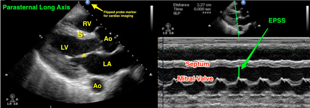
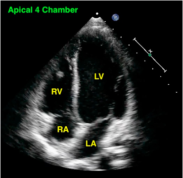
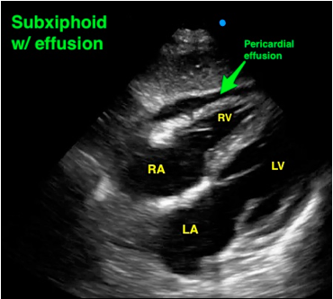

---

title: Focused Echocardiography
authors:
    - Jimmy Fair, MD
    - Mike Mallon, MD
    - Mike Stone, MD
created: 2015/02/11
updates:
categories:
    - Cardiovascular
    - Ultrasound
---

# Ultrasound: Focused Echocardiography

**Goals:** Evaluate for pericardial effusion, general cardiac function, and evidence of right heart strain.

**Transducer:** Low frequency phased array transducer

**Windows:** Can be performed in any order. Try alternative windows if initial choice is unsuccessful. Standard cardiac imaging places the screen indicator on the right side of the screen. Using abdominal or other machine presets where the screen indicator is on the left side of the screen will require a 180-degree flip of the transducer from the description below.

Figure 1: Standard transducer placement for the basic transthoracic echocardiography examination

## 1. Parasternal Long-Axis (PSLA)

- **Anatomic landmarks**: Just left of sternum, 4th or 5th intercostal space
- **Initial transducer orientation:** Place directional indicator towards right shoulder. Align image to include both aortic and mitral valve. Place mitral valve in center of screen.

Figure 2: Parasternal Long Axis view with measurement. Note the right ventricle **(RV)**, interventricular septum **(S)**, left ventricle **(LV)**, left atrium **(LA)**, anterior mitral valve leaflet **(\*)**, and aorta **(Ao)** seen at its root adjacent to the aortic valve and again descending deep to the heart. EPSS is measured in M-mode (right panel) as the distance from the interventricular septum to the first upstroke of the anterior mitral valve leaflet in diastole – used to help determine LV ejection fraction.

## 2. Parasternal Short-Axis (PSSA)

- **Anatomic landmarks**: Same location as PSLX. Rotate transducer 90o clockwise.
- **Initial transducer orientation:** Directional indicator towards left shoulder. Fan transducer towards right shoulder for image of aortic valve. Fan transducer towards left hip for image of mid LV cavity.

Figure 3: PSSA view with right ventricle **(RV),** circular left ventricle **(LV)**, and **papillary muscles**

## 3. Apical 4-chamber (A4)

- **Anatomic landmarks**: Point of Maximal Impulse (usually 2 cm below nipple).
- **Initial transducer orientation:** Directional indicator towards left axilla with transducer angled towards right shoulder. Try to locate over the true apex of the heart and align both tricuspid and mitral valves. Septum should be vertical in image.

Figure 4: Apical 4 Chamber view demonstrating the right ventricle **(RV)**, right atrium **(RA)**, left ventricle **(LV)** and left atrium **(LA)**. Note the vertical orientation of the septum.

## 4. Subxiphoid

- **Anatomic landmarks**: Transducer just below xiphoid process. Slightly to patient’s right.
- **Initial transducer orientation:** Transducer marker towards patient’s **_left_** with transducer angled towards left shoulder. (Transducer is flipped from FAST view due to flipped screen indicator in cardiac imaging). Flatten transducer on abdomen.

Figure 5: Subxiphoid 4-chamber view showing right ventricle **(RV)**, right atrium **(RA)**, left ventricle **(LV)** and left atrium **(LA)**. Note the small **pericardial effusion**.

## Signs of Important Pathology

**Pericardial effusion**: 

Anechoic (black) stripe encircling the heart. Pericardial effusion on PSLA will track between descending thoracic aorta and left atrium. Pleural effusion will not.

**Pericardial tamponade:** 

Pericardial effusion with RV free wall collapse in diastole. IVC should be dilated without respiratory variation in tamponade. RA systolic collapse is an early finding. **_Tip:_** Use M-Mode through mitral valve to help with timing of RV collapse.

**Hypovolemia:** 

Hyperdynamic heart with left ventricular walls almost touching in systole as seen in the parasternal long axis view.

**Right heart strain:** 

RV size greater than LV (normal ratio is 0.6:1) when seen in the apical 4-chamber view. Flattened septum in parasternal short axis with a D-shaped LV. Poor RV function (size doesn’t change much from systole to diastole).

**Systolic heart failure:** 

Poor ventricular squeeze. Mitral valve does not open widely as seen in parasternal long-axis. **_EPSS_**: Using the PSLA measured distance between mitral valve and septum in diastole. Abnormal EPSS >7 mm = poor LV ejection fraction.

## Struggling with the Exam?

**Can’t find the heart?**

Place the patient in the left lateral decubitus position, which brings the heart closest to the chest wall. Lung artifact is common and asking the patient to exhale can improve your image. Try rib interspaces above and below standard locations.

**Rib shadows obstructing view?** Try moving the transducer up or down to get between the ribs, then angle the transducer towards the heart once you have a good acoustic window.

## Common Errors

Pleural effusion can be mistaken for pericardial effusion. To differentiate, locate the descending thoracic aorta in the parasternal long-axis view. Pericardial effusions will track superficial to the descending thoracic aorta. Pleural effusions will track deep.

Non-orthogonal planes can be mistaken for an enlarged right heart or D-sign. Make sure the LV looks round in the PSSA and that the apex is at the top of the screen in the apical windows.

Anterior fat pad can be mistaken for pericardial effusion, but will have internal echos (not anechoic) and will not spread all the way around the circumference of the heart when imaged in different views.

## References

- Randazzo MR et al. _Acad Emerg Med_, 2003. PMID: [12957982](http://www.ncbi.nlm.nih.gov/pubmed/?term=Randazzo+Acad+Emerg+Med%2C+2003.)

- Nagdev A, Stone MB. _Resuscitation_, 2011. PMID: [21397379](http://www.ncbi.nlm.nih.gov/pubmed/?term=Nagdev%2C+A.%2C+%26+Stone%2C+M.+B.+Resuscitation%2C+2011.)
