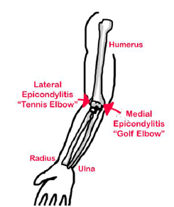

---

title: Elbow Injuries - Epicondylitis, Lateral or Medial
authors:
   - Melody Glenn, MD
   - Andrew Little, DO
   - Mary Haas, MD
created: 2016/12/12
updates: null
categories:
   - Peer Reviewed
   - Orthopedics

---

# Elbow Injuries: Epicondylitis, Lateral or Medial

## Xray Views
**No XRs:** A clinical diagnosis.
**Lateral:** Focal epicondyle tenderness, decreased grip strength, pain with resisted wrist extension.
**Medial:** Focal epicondyle tenderness, pain with resisted wrist flexion and forearm pronation.

## Acute Management
- Elbow rest.
- Ice.
- Daily NSAIDs.
- Counter-force strap brace.
- Wrist stretching and strengthening exercises.

## Follow-up Timing

Routine follow up with primary care physician.

## Notes

### Lateral
- Overuse of forearm extensor and supinator muscles
- Associated with radial tunnel syndrome

### Medial
- Overuse of forearm flexor and pronator muscles
- Associated with ulnar neuropathy and ulnar collateral ligament insufficiency

## References
- Wheeless’ Textbook of Orthopaedics [Link](http://Wheelessonline.com)
- Orthobullets [Link](http://OrthoBullets.com)
- Radiopaedia [Link](http://Radiopaedia.org)
- General Guidelines For Management for Orthopedic Injuries card by the Nationwide Children’s Hospital, Dept of Orthopedics.
