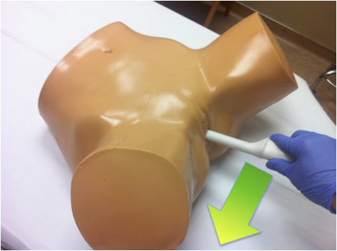
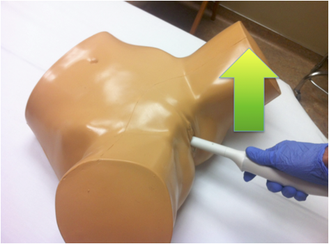

---

title: 'Focused 1st Trimester Pregnancy Transvaginal Ultrasound'
authors:
    - 'Matt Lipton, MD'
    - 'Mike Mallin, MD'
    - 'Mike Stone, MD'
created: 2015/03/04
updates: null
categories:
    - Ultrasound
    - Radiology
    - OBGYN
drugs: null

---

# Ultrasound: Focused 1st Trimester Pregnancy (Transvaginal Assesment)

**Goals:**

1.  Confirm intrauterine pregnancy (IUP) and estimating its viability
2.  Look for signs of ectopic pregnancy

**Transducer:** High-frequency endocavitary transducer

**Windows:** Transvaginal view using cervix as window

## 1. Coronal / transverse view

**Directional indicator:** Pointed to patient’s right side

Figure 1: Appropriate transducer orientation for the coronal transvaginal exam

Figure 2: Ectopic pregnancy on transvaginal ultrasound, coronal view. Shown is a **yolk sac** **within an extra-uterine gestational sac** (black arrow) adjacent to an empty **endometrium (e)**, outside of the **uterus**.

## 2.  Sagittal / longitudinal view

**Directional indicator**: Pointed to anterior of patient (towards the ceiling)

Figure 3: Appropriate transducer orientation for the sagittal transvaginal exam

Figure 4: Intrauterine pregnancy on transvaginal ultrasound, sagittal view. Shown is a **gestational sac** containing a **yolk sac** and within the **endometrium.**

Both of these windows include a complete sweep through the uterus in each direction looking for a gestational sac and yolk sac or fetal pole within the endometrium.

## Interpretation and Tips

An IUP for point-of-care purposes is defined as a **yolk sac or fetal pole within a gestational sac within the endometrium**. This indirectly excludes an ectopic pregnancy in an appropriate clinical setting.

Consider measuring the distance between the gestational sac and the edge of uterus. If this endomyometrial mantle thickness is &lt;8 mm, then consider the possibility of an interstitial ectopic pregnancy.

An ectopic pregnancy will occasionally be seen as an extrauterine mass. However, free fluid in a pregnant patient without an IUP should also be considered an ectopic pregnancy until proven otherwise.

## Pitfalls

**Inserting the transducer too deeply.** 

- The transducer should be inserted to the cervix, using it as a window. If you continue to push once at the cervix, the transducer will frequently slide into the posterior fornix and only bowel/rectum will be seen.

**Scanning with a full bladder.** 

- While the transabdominal approach is enhanced by a full bladder, the patient should empty their bladder prior to transvaginal scanning to improve visualization.

**Calling a gestational sac an IUP.** 

- At least a yolk sac is needed. A pseudogestational sac with an ectopic pregnancy is possible.

**Relying on the quantitative beta-HCG and “discriminatory zone” for decision-making.** 

- Over 40% of ectopic pregnancies will have beta-HCG levels below the discriminatory zone.

**Considering an “inconclusive scan” negative for ectopic**. 

- Ectopic pregnancies are almost always ruled-out by finding an IUP. Absence of an extrauterine mass does not exclude ectopic pregnancy.

**Failure to recognize specific high-risk populations.** 

- Patients undergoing assisted reproductive therapy have a much higher (1-3%) incidence of heterotopic pregnancy. Identification of an IUP does not exclude a co-existing ectopic in this group.

## References

- Wang R, et al. *Annals of Emerg Med,* 2011. PMID: [21310509](http://www.ncbi.nlm.nih.gov/pubmed/?term=Use+of+a+%CE%B2-hCG+discriminatory+zone+with+bedside+pelvic+ultrasonography.)
- Tayal, VS, et al. *Acad Emerg Med,* 2004. PMID: [15347539](http://www.ncbi.nlm.nih.gov/pubmed/15347539)
