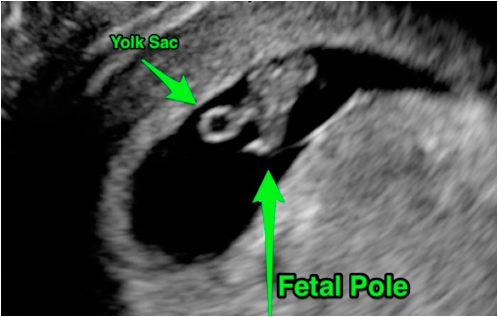

---

title: Focused 1st Trimester Pregnancy Transabdominal Ultrasound
authors:
    - Matt Lipton, MD
    - Mike Mallin, MD
    - Mike Stone, MD
created: 2015/02/25
updates: null
categories:
    - Radiology
    - Ultrasound
    - OBGYN
---

# Ultrasound: Focused 1st Trimester Pregnancy (Transabdominal Exam)

**Goals:**

1. Confirm intrauterine pregnancy (IUP) and estimating its viability
2. Look for signs of ectopic pregnancy

**Transducer:** Low frequency curvilinear transducer

**Windows:** Suprapubic view with a full bladder (improves ability to visualize the uterus) in longitudinal (sagittal) and transverse (axial) planes

## Normal IUP Findings

1. **Yolk sac:** Round fluid-filled structure within the gestational sac, located in the endometrium
2. **Fetal pole:** Small mass located near the yolk sac

Figure 1: Normal early IUP showing **yolk sac** and **fetal pole**

Figure 2: Close-up image of a normal early IUP showing a **yolk sac** within a gestational sac

## Normal Reference Measurements

1. Fetal heart rate (FHR) between 120-160 bpm (can be as low as 100 bpm in early gestation)
2. Myometrium surrounding the IUP should be ≥ 8mm (endomyometrial mantle)

**How to use the serum quantitative beta-HCG**

- Do not to use a single beta-HCG data point alone in ED patient management.
- There is no cutoff value that has been shown to adequately identify those patients for which an IUP should be visualized.
- Order the test if you are unable to find an IUP because Ob/Gyn consultants will want to trend the value. 
- **DO NOT** use a quantitative beta-HCG as a reason not to perform a bedside ultrasound. Many patients with ectopic pregnancy have values below the traditional cutoff of 2,000-2,500 mIU/mL.

## Signs of Ectopic Pregnancy

- **Failure to identify an IUP** is the first indication that an ectopic may be present.
- Other signs include: Free fluid in the pelvis and/or masses in the adnexa
- An ectopic pregnancy in the tube or ovary often has a “ring of fire” with color Doppler imaging. However, most ectopic pregnancies are not visible with transabdominal ultrasound.
- **Free intraperitoneal fluid** in Morison’s pouch is a **sign of a ruptured ectopic** that will likely require operative intervention.

Figure 3: **Empty fluid-filled sac** within the endometrium. Given the absence of contents, you cannot differentiate gestational vs pseudogestational sac. This is **not** diagnostic of an IUP.

## Struggling with the Exam?

**Can’t visualize the uterus?**

- Perform the ultrasound before the patient urinates. If unable to visualize key structures, proceed to a transvaginal ultrasound.

**Can’t find a yolk sac or fetal pole?**

1. **There may not be an IUP**. The patient may have an ectopic pregnancy or a OOcompleted abortion.
2. **It may be too early** to visualize an IUP with transabdominal scanning. IUPs are difficult to visualize before 6-6.5 weeks gestational age. This may require a transvaginal ultrasound instead, which can visualize earlier IUPs.

## Common Errors

- Only using close-up, zoomed view to evaluate for intrauterine pregnancy. Be sure to get a “big picture” view of the pelvis to identify all relevant structures prior to using the zoom function.

**Mistaking a pseudogestational sac for an IUP**: 

- A pseudogestational sac is a small fluid collection from an endometrial reaction to hormones produced by the ectopic pregnancy. This will appear within the endometrial cavity and can be seen in up to 20% of ectopic pregnancies. You **MUST** visualize at least a yolk sac within a gestational sac (located in the endometrium) before an IUP can be confirmed.

**Interstitial (cornual) pregnancy**: 

- Although most ectopic pregnancies occur in the fallopian tubes, 3% of ectopic pregnancies implant on the edge of the uterus. This form of ectopic pregnancy can be identified by noting an eccentric location of the gestational sac within the endometrium, often with &lt;8 mm of surrounding myometrium.

**Assuming an IUP rules-out an ectopic pregnancy for those undergoing assisted reproductive therapies (ART) such as in-vitro fertilization.** 

- The risk of a heterotopic pregnancy is too high.

**Using pulsed wave or color Doppler on the fetus to confirm fetal heart rate or viability.** 

- Both pulse wave and color Doppler inflict unnecessary thermal energy to the developing fetus. M-Mode is sufficient for measuring fetal heart rate.

## References

- Wang R., et al. _Annals of Emerg Med,_ 2011. PMID: [21310509](http://www.ncbi.nlm.nih.gov/pubmed/?term=Use+of+a+%CE%B2-hCG+discriminatory+zone+with+bedside+pelvic+ultrasonography.)

- Tayal VS, et al. _Acad Emerg Med,_ 2004. PMID: [15347539](http://www.ncbi.nlm.nih.gov/pubmed/15347539)
