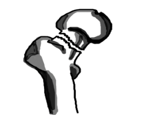

---

title: Hip Injuries - Femoral Neck Fracture
authors:
    - Layla Abubshait, MD
    - Michael Gottlieb, MD, RDMS
    - Mary Haas, MD
created: 2016/11/14
updates: null
categories:
    - Orthopedics
---

# Hip Injuries: Femoral Neck Fracture

## Xray Views

-   AP pelvis
-   Cross-table lateral of hip
-   AP/lateral of entire femur

## Acute Management

Surgery

## Follow-up Timing

Admit and consult an orthopedic surgeon.

## Notes

High risk for missed occult fracture:

-   Up to 10% are radiographically occult (XR negative)
-   At risk: Older osteoporotic patient
-   MRI is definitive, subsequent imaging modality

## References

1.  [Gill SK, Smith J, Fox R, Chesser TJ. Investigation of occult hip fractures: the use of CT and MRI. Scientific World Journal. 2013;2013:830319.](https://www.ncbi.nlm.nih.gov/pubmed/?term=23476147)

2.  [Rodriguez-Merchan EC, Moraleda L, Gomez-Cardero P. Injuries associated with femoral shaft fractures with special emphasis on occult injuries. Arch Bone Jt Surg. 2013 Dec;1(2):59-63.](https://www.ncbi.nlm.nih.gov/pubmed/?term=25207289)
