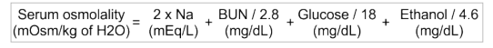

# Approach to Increased Osmolar Gap

## Background and Calculations

**Serum osmolality:** Contributed by ions and low-molecular-weight solutes

**Osmolal gap = Calculated osmolality – Measured osmolality**

- Normal OG = -10 to +10 mOsm/kg of H2O

## Osmolal gap

- Most common cause: Ethanol 
- Osmolal ap calculation includes ethanol correction factor (4.6)
- Osmoloal gap screens for toxic alcohols with decreasing sensitivity: 
  - Methanol
  - Ethanol
  - Isopropanol
  - Ethylene glycol
  - Propylene glycol
  - Diethylene glycol
- A gap &ge; 20 suggests ethanol or toxic alcohol exposure
  - Although case reports of diabetic ketoacidosis causing osmolal gap &ge; 20

**Toxic alcohols**

- Parent unmetabolized alcohols --> Contributes to osmolal gap
- Metabolites of alcohols --> Contributes to toxic effects (except isopropanol)

<table>
<colgroup>
<col width="100%" />
</colgroup>
<thead>
<tr class="header">
<th> <b>Causes for High anion gap metabolic acidosis + High osmolal gap</b></th>
</tr>
</thead>
<tbody>
<tr class="odd">
<td>Acute kidney injury 
Intoxication, salicylates 
Intoxication, toxic alcohol 
<ul>
<li>Methanol</li>
<li>Ethylene glycol</li>
<li>Diethylene glycol</li>
<li>Propylene glycol</li>
<li>Isopropanol glycol</li></ul>
Ketoacidosis, alcoholic or diabetic 
Lactic acidosis 
</td>
</tr>
</tbody>
</table>

### Caution

Toxic alcohols may not cause significant osmolal gap because:

1. High molecular weight toxic alcohols (eg. propylene glycol, diethylene glycol) do not affect the osmolality as much
2. Wide range of normal osmolal gap (can be as low as -10)
3. Only the parent alcohol (not the metabolites) causes osmolal gap

**Tip: **Consider toxic alcohols for cases of high anion gap metabolic acidosis even with normal osmolal gap

## References

- Kraut JA, Xing SX. Approach to the evaluation of a patient with an increased serum osmolal gap and high-anion-gap metabolic acidosis. Am J Kidney Dis. 2011 Sep;58(3):480-4. doi: 10.1053/j.ajkd.2011.05.018. Epub 2011 Jul 27. [PubMed](https://www.ncbi.nlm.nih.gov/pubmed/?term=21794966)
