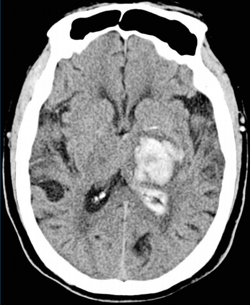
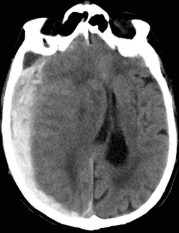
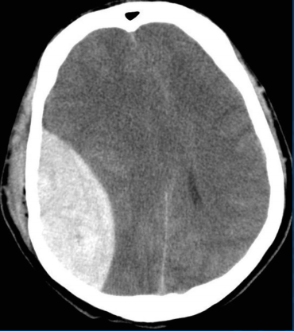
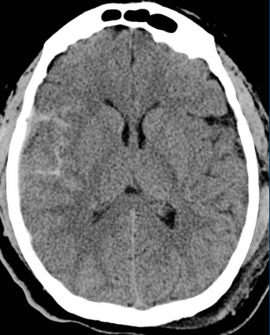
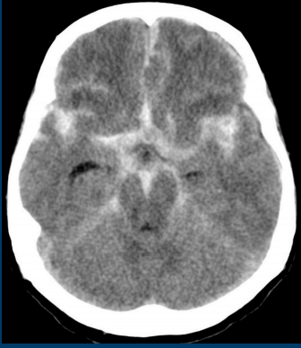

---

title: ED Management of Intracranial Hemorrhage
authors:
    -  William Shyy, MD 
    - Debbie Yi Madhok, MD
created: 2017/09/04
updates:
categories:
    - Trauma
    - Neurology

---

# ED Management of Intracranial Hemorrhage

Robust and comprehensive studies now support specific management guidelines for patients presenting with different intracranial hemorrhages (ICH). From the Emergency Department perspective, the primary dilemmas involve specific blood pressure goals and whether seizure prophylaxis with phenytoin is necessary. [The Brain Trauma Foundation](https://braintrauma.org/uploads/03/12/Guidelines_for_Management_of_Severe_TBI_4th_Edition.pdf) provides an excellent summary of the current guidelines.

## Summary on the Management of Intracranial Hemorrhages

### Primary ICH

**Systolic BP Goal (mmHg)**: &lt; 140-180

**Seizure Prophylaxis**: No

**Therapy**:
- External ventricular drain (EVD) if Glasgow Coma Scale (GCS) &lt; 9, significant intraventricular hemorrhage with obstructive hydrocephalus, or herniation
- no platelets

### Subdural ICH

**Systolic BP Goal (mmHg)**: Age-dependent blood pressure goal: SBP ≥ 100 mmHg (age 50-69 years) and SBP ≥ 110 mmHg (age >70 years)

**Seizure Prophylaxis**: Phenytoin if GCS &le; 10.

**Therapy**: Surgery if

- Width &gt; 10 mm
- Midline shift &gt; 5 mm
- GCS &lt; 9 or GCS change &ge; 2

### Epidural ICH

**Systolic BP Goal (mmHg)**: Age-dependent blood pressure goal: SBP ≥ 100 mmHg (age 50-69 years) and SBP ≥ 110 mmHg (age >70 years)

**Seizure Prophylaxis**: Phenytoin if GCS &le; 10.

**Therapy**: Surgery if

- Volume &gt; 30 mL
- GCS &lt; 9 with asymmetric pupils

### Traumatic Subarachnoid Hemorrhage (SAH)

**Systolic BP Goal (mmHg)**: Age-dependent blood pressure goal: SBP &ge; 100 mmHg (age 50-69 years) and SBP &ge; 110 mmHg (age &gt; 70 years)

**Seizure Prophylaxis**: Phenytoin if GCS &le; 10.

**Therapy**: Supportive management

### Spontaneous SAH

**Systolic BP Goal (mmHg)**: &lt; 140-160

**Seizure Prophylaxis**: No

**Therapy**:

- Early clipping vs coiling
- Transfer to high-volume SAH center

## Primary Intracranial Hemorrhages

Primary ICHs include both intraventricular and intraparenchymal bleeds. The majority are due to severe hypertension and are localized to the cerebellum, brainstem, and midbrain. Other etiologies include aneurysm and tumor. Up to 30% of these cases expand within the first 3 hours of onset, which is why treatment guidelines include a systolic blood pressure (SBP) goal of &lt; 140-180 mmHg. This is often achieved with an IV infusion of a vasodilator, such as nicardipine or nitroprusside. In patients with primary ICH, seizure prophylaxis and platelet transfusion may lead to worse outcomes. Indications for an external ventricular drain (EVD) include any of the following:

- Confirmed ICH with a GCS &lt; 9
- Transtentorial herniation
- Significant intraventricular hemorrhage with hydrocephalus

## Traumatic Brain Injury including Epidural, Subdural, and Subarachnoid Hemorrhages

In contrast to primary ICHs, phenytoin has been shown to be of benefit for acute traumatic brain injury (TBI). It decreases the incidence of early (≤ 7 days) post-traumatic seizures. Phenytoin is the preferred agent for a patient with a traumatic ICH and a GCS ≤ 10. However, if a patient meets any of the below criteria for seizure prophylaxis but the GCS > 10, then either phenytoin or levetiracetam is acceptable.

### Indications for seizure prophylaxis in traumatic ICH 8–13

- GCS &le; 10 (phenytoin is the agent of choice)
- Depressed skull fracture
- Subdural or epidural hematoma
- Hemorrhagic contusion
- Penetrating head trauma
- Seizure within the first 24 hours

### Blood pressure goals in traumatic ICH

- Age 50-69 years: SBP &ge; 100 mmHg
- Age &gt; 70 years: SBP &ge; 110 mmHg 

### Surgical intervention for subdural hemorrhages

- Width &gt; 10 mm
- Midline shift &gt; 5 mm
- GCS &lt; 9 or GCS change &ge; 2 since injury

### Surgical intervention for epidural hemorrhages

- Hemorrhage volume &gt; 30 cm3
- GCS &lt; 9 with asymmetric pupils

Spontaneous Subarachnoid Hemorrhage (SAH)

Spontaneous, atraumatic SAHs have a 5-10% chance of rebleeding in the first 72 hours. Most are due to a ruptured aneurysm and have a SBP goal < 140-160 mmHg until the aneurysm is secured. These hemorrhages should not receive seizure prophylaxis as no benefit has been shown. Early clipping or coiling of the aneurysm is imperative to survival and may require transfer to a high-volume SAH center.

## References

- Carney N, Totten A M, O’Reilly C, et al. Guidelines for the Management of Severe Traumatic Brain Injury. Brain Trauma Foundation. Published September 2016. Accessed August 10, 2017. [[Source](https://braintrauma.org/uploads/03/12/Guidelines_for_Management_of_Severe_TBI_4th_Edition.pdf)]
- Anderson C, Heeley E, Huang Y, et al. Rapid blood-pressure lowering in patients with acute intracerebral hemorrhage. N Engl J Med. 2013;368(25):2355-2365. [[PubMed](https://www.ncbi.nlm.nih.gov/pubmed/23713578)]
- Qureshi A, Palesch Y, Barsan W, et al. Intensive Blood-Pressure Lowering in Patients with Acute Cerebral Hemorrhage. N Engl J Med. 2016;375(11):1033-1043. [[PubMed](https://www.ncbi.nlm.nih.gov/pubmed/27276234)]
- Baharoglu M, Cordonnier C, Al-Shahi S, et al. Platelet transfusion versus standard care after acute stroke due to spontaneous cerebral haemorrhage associated with antiplatelet therapy (PATCH): a randomised, open-label, phase 3 trial. Lancet. 2016;387(10038):2605-2613. [[PubMed](https://www.ncbi.nlm.nih.gov/pubmed/27178479)]
- Naidech A, Garg R, Liebling S, et al. Anticonvulsant use and outcomes after intracerebral hemorrhage. Stroke. 2009;40(12):3810-3815. [[PubMed](https://www.ncbi.nlm.nih.gov/pubmed/19797183)]
- Messé S, Sansing L, Cucchiara B, et al. Prophylactic antiepileptic drug use is associated with poor outcome following ICH. Neurocrit Care. 2009;11(1):38-44. [[PubMed](https://www.ncbi.nlm.nih.gov/pubmed/19319701)]
- Becker K, Baxter A, Bybee H, Tirschwell D, Abouelsaad T, Cohen W. Extravasation of radiographic contrast is an independent predictor of death in primary intracerebral hemorrhage. Stroke. 1999;30(10):2025-2032. [[PubMed](https://www.ncbi.nlm.nih.gov/pubmed/10512902)]
- Torbic H, Forni A, Anger K, Degrado J, Greenwood B. Use of antiepileptics for seizure prophylaxis after traumatic brain injury. Am J Health Syst Pharm. 2013;70(9):759-766. [[PubMed](https://www.ncbi.nlm.nih.gov/pubmed/23592358)]
- Ferguson P, Smith G, Wannamaker B, Thurman D, Pickelsimer E, Selassie A. A population-based study of risk of epilepsy after hospitalization for traumatic brain injury. Epilepsia. 2010;51(5):891-898. [[PubMed](https://www.ncbi.nlm.nih.gov/pubmed/19845734)]
- Inaba K, Menaker J, Branco B, et al. A prospective multicenter comparison of levetiracetam versus phenytoin for early posttraumatic seizure prophylaxis. J Trauma Acute Care Surg. 2013;74(3):766-71; discussion 771-3. [[PubMed](https://www.ncbi.nlm.nih.gov/pubmed/23425733)]
- Szaflarski J, Sangha K, Lindsell C, Shutter L. Prospective, randomized, single-blinded comparative trial of intravenous levetiracetam versus phenytoin for seizure prophylaxis. Neurocrit Care. 2010;12(2):165-172. [[PubMed](https://www.ncbi.nlm.nih.gov/pubmed/19898966)]
- Bhullar I, Johnson D, Paul J, Kerwin A, Tepas J, Frykberg E. More harm than good: antiseizure prophylaxis after traumatic brain injury does not decrease seizure rates but may inhibit functional recovery. J Trauma Acute Care Surg. 2014;76(1):54-60; discussion 60-1. [[PubMed](https://www.ncbi.nlm.nih.gov/pubmed/24368357)]
- Young B, Rapp R, Norton J, Haack D, Tibbs P, Bean J. Failure of prophylactically administered phenytoin to prevent late posttraumatic seizures. J Neurosurg. 1983;58(2):236-241. [[PubMed](https://www.ncbi.nlm.nih.gov/pubmed/6848681)]
- Seelig J. Increased ICP and systemic hypotension during the first 72 hours following severe head injury. In: Intracranial Pressure. Vol VI. Springer; 1986:675-679.
- Brenner M, Stein D, Hu P, Aarabi B, Sheth K, Scalea T. Traditional systolic blood pressure targets underestimate hypotension-induced secondary brain injury. J Trauma Acute Care Surg. 2012;72(5):1135-1139. [[PubMed](https://www.ncbi.nlm.nih.gov/pubmed/22673237)]
- Murray G, Butcher I, McHugh G, et al. Multivariable prognostic analysis in traumatic brain injury: results from the IMPACT study. J Neurotrauma. 2007;24(2):329-337. [[PubMed](https://www.ncbi.nlm.nih.gov/pubmed/17375997)]
- Chesnut R, Marshall L, Klauber M, et al. The role of secondary brain injury in determining outcome from severe head injury. J Trauma. 1993;34(2):216-222. [[PubMed](https://www.ncbi.nlm.nih.gov/pubmed/8459458)]
- Fearnside M, Cook R, McDougall P, McNeil R. The Westmead Head Injury Project outcome in severe head injury. A comparative analysis of pre-hospital, clinical and CT variables. Br J Neurosurg. 1993;7(3):267-279. [[PubMed](https://www.ncbi.nlm.nih.gov/pubmed/8338647)]
- Marmarou A, Eisenberg H M, Foulkes M A, Marshall L F, Jane J A. Impact of ICP instability and hypotension on outcome in patients with severe head trauma. JNS. 1991;75(1):59-66. [[DOI](http://thejns.org/doi/abs/10.3171/sup.1991.75.1s.0s59)]
- Miller J, Sweet R, Narayan R, Becker D. Early insults to the injured brain. JAMA. 1978;240(5):439-442. [[PubMed](https://www.ncbi.nlm.nih.gov/pubmed/660888)]
- Miller J, Becker D. Secondary insults to the injured brain. J R Coll Surg Edinb. 1982;27(5):292-298. [[PubMed](https://www.ncbi.nlm.nih.gov/pubmed/7143298)]
- Pietropaoli J, Rogers F, Shackford S, Wald S, Schmoker J, Zhuang J. The deleterious effects of intraoperative hypotension on outcome in patients with severe head injuries. J Trauma. 1992;33(3):403-407. [[PubMed](https://www.ncbi.nlm.nih.gov/pubmed/1404509)]
- Rose J, Valtonen S, Jennett B. Avoidable factors contributing to death after head injury. Br Med J. 1977;2(6087):615-618. [[PubMed](https://www.ncbi.nlm.nih.gov/pubmed/409450)]
- Berry C, Ley E, Bukur M, et al. Redefining hypotension in traumatic brain injury. Injury. 2012;43(11):1833-1837. [[PubMed](https://www.ncbi.nlm.nih.gov/pubmed/21939970)]
- Panczykowski D, Pease M, Zhao Y, et al. Prophylactic Antiepileptics and Seizure Incidence Following Subarachnoid Hemorrhage: A Propensity Score-Matched Analysis. Stroke. 2016;47(7):1754-1760. [[PubMed](https://www.ncbi.nlm.nih.gov/pubmed/27301932)]
