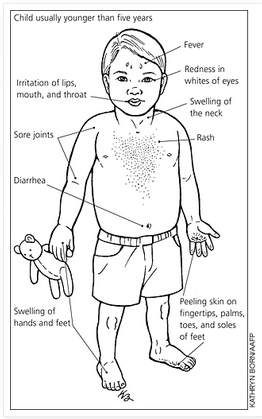
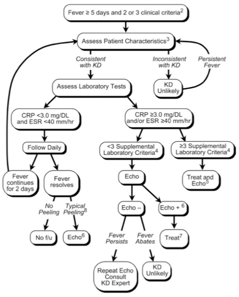

---

title: Kawasaki Disease
authors:
    - Michelle Lin, MD
created: 2012/03/23
updates:
categories:
    - Pediatrics
---

# Kawasaki Disease

**Definition:** Acute, self-limited vasculitis of unknown etiology that occursmostly in infants and young children 

**Classic clinical criteria**

1. **Fever for &ge; 5 days**, AND
2. At least **4** of the 5 following:

- Bilateral bulbar nonexudative conjunctivitis
- Cervical lymphadenopathy (> 1.5 cm diameter), usually unilateral
- Changes in lips and oral cavity
  - Erythema
  - Lip cracking
  - Strawberry tongue
  - Diffuse injection of oral/pharyngeal mucosae
- Changes in extremities
  - Acute: Erythema of palms or soles; edema of hands or feet
  - Subacute: Periungual peeling of fingers or toes in weeks #2-3 
- Polymorphous rash

## Complications and differential diagnosis

**Complication:** Coronary artery aneurysms/ ectasis --> risk of MI,sudden death, ischemic heart disease (15-25% untreated, 5% if treated)

**Differential Diagnosis**

- Viral infections (measles, adenovirus, enterovirus, EBV)
- Scarlet fever
- Staphylococcal scalded skin syndrome
- Toxic shock syndrome
- Bacterial cervical lymphadenitis
- Drug hypersensitivity reaction
- Stevens-Johnson syndrome
- Juvenile rheumatoid arthritis
- Rocky Mountain Spotted Fever
- Leptospirosis
- Mercury hypersensitivity reaction 

## AHA 2004 guideline: Evaluation of suspected incomplete Kawasaki Disease

**AHA consensus recommendations**

1. Infants &le; 6 months old on day &ge; 7 of fever without other explanation should undergo lab testing and, if evidence of systemic inflammation is found, an echocardiogram, even if they have no clinical criteria
2. Check for classic findings
3. Supplemental lab criteria

- Albumin &le;3.0 g/dL
- Anemia for age
- Elevation of ALT
- Platelets after 7 d &ge;450,000/mm3
- WBC &ge;15,000/mm3,
- Urine &ge;10 WBC/hpf

4. Can treat before performing echocardiogram.
5. Echo is considered positive for purposes of this algorithm, if any of 3 conditions met: 

- z score of LAD or RCA &ge; 2.5
- Coronary arteries meet Japanese Ministry of Health criteria for aneurysms, or 
- &ge; 3 other suggestive features exist, including: perivascular brightness, lack of tapering, decreased LV function, mitral regurgitation, pericardial effusion, or z scores in LAD or RCA of 2–2.5

6. If echo is positive, treatment should be given to children within 10 d of fever onset and those > day 10 with clinical and lab signs (CRP, ESR) of ongoing inflammation
7. Typical peeling begins under nail bed of fingers and then toes

## References

- Newburger JW et. al. Diagnosis, treatment, and long-term management of Kawasaki disease: a statement for health professionals from the Committee on Rheumatic Fever, Endocarditis and Kawasaki Disease, Council on Cardiovascular Disease in the Young, American Heart Association.Circulation. 2004 Oct 26;110(17):2747-71. [PubMed](http://www.ncbi.nlm.nih.gov/pubmed/?term=15505111)
