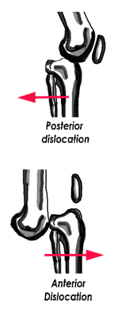

# Knee Injuries: Knee Dislocation

## X-ray Views

### AP view

- Look especially for small avulsions, such as a Segond fracture, which is a lateral tibial condyle avulsion fracture

### Lateral view

- Look for symmetric or irregular joint space

## Acute Management

**_Orthopedic vascular emergency!_**

- Reduce knee and re-examine neurovascular status
- Consult vascular surgery for hard signs of vascular injury

Measure the Ankle-Brachial index(ABIs):
- ABI &ge; 0.9: Monitor by serial exam
- ABI &lt; 0.9: Obtain CT angiography

Splint knee in 20-30 degrees of flexion

## Follow-Up Timing

Hospital admission required for serial neurovascular exams and consideration for surgical stabilization

## Notes

**Dimple sign** 
- Buttonholing of medial femoral condyle through medial capsule
- Suggests irreducible posterolateral dislocation

**Associated findings with knee dislocations**

- Popliteal artery injury (18%)
- Common peroneal nerve injury (25%) – check for foot dorsiflexion weakness and numbness to dorsal foot
- Ligament tears

## References

- Schwartz A. Patella Fractures Treatment & Management, Emedicine.com (June 2016) [[Source](http://emedicine.medscape.com/article/1249384-treatment)].
- Hinton RY, Sharma KM. Acute and recurrent patellar instability in the young athlete. Orthop Clin North Am. 2003 Jul;34(3):385-96. [[PubMed](https://www.ncbi.nlm.nih.gov/pubmed/?term=12974488)]
- Ji G, et al . Surgical versus Nonsurgical Treatments of Acute Primary Patellar Dislocation with Special Emphasis on the MPFL Injury Patterns. J Knee Surg. 2016 Sep 14. Epub ahead of print. [[PubMed](https://www.ncbi.nlm.nih.gov/pubmed/?term=27626368.)]
- Petri M, et al. Current Concepts for Patellar Dislocation. Arch Trauma Res. 2015 Sep 1;4(3):e29301. [[PubMed](https://www.ncbi.nlm.nih.gov/pubmed/?term=26566512)]
- Medina O, et al. Vascular and nerve injury after knee dislocation: a systematic review. Clin Orthop Relat Res. 2014 Sep;472(9):2621-9. [[PubMed](https://www.ncbi.nlm.nih.gov/pubmed/?term=24554457)]
