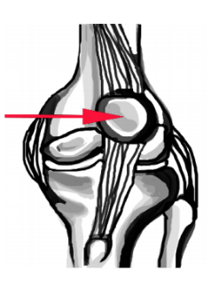

---

title: Knee Injuries - Patella Dislocation
authors:
    - Layla Abubshait, MD
    - Michael Gottlieb, MD, RDMS
    - Mary Haas, MD
created: 2016/11/21
updates:
categories:
    - Orthopedics
---

# Knee Injuries: Patella Dislocation

## X-ray Views

- AP knee
- Lateral knee: Best to assess for displacement
- Patella view: (sunrise or Merchant)

## Acute Management

- Closed reduction
- Splint in above-knee plaster cast (from distal 2/3s thigh to MTP foot joints), straight leg immobilizer, or hinged knee brace
- Weight-bearing as tolerated with crutches

## Follow-up Timing

Within 1-2 weeks

Consider sooner F/U to assess for associated osteochondral fractures and medial patellofemoral ligament injury, which may require operative repair 

## Notes

Most managed non-operatively

Complications: recurrent dislocations

## References

- Schwartz A. Patella Fractures Treatment & Management, Emedicine.com (June 2016) [Link](http://emedicine.medscape.com/article/1249384-treatment).

- Hinton RY, Sharma KM. Acute and recurrent patellar instability in the young athlete. Orthop Clin North Am. 2003 Jul;34(3):385-96. [PubMed](https://www.ncbi.nlm.nih.gov/pubmed/?term=12974488)

- Ji G, et al . Surgical versus Nonsurgical Treatments of Acute Primary Patellar Dislocation with Special Emphasis on the MPFL Injury Patterns. J Knee Surg. 2016 Sep 14. Epub ahead of print. [PubMed](https://www.ncbi.nlm.nih.gov/pubmed/?term=27626368.)

- Petri M, et al. Current Concepts for Patellar Dislocation. Arch Trauma Res. 2015 Sep 1;4(3):e29301. [PubMed](https://www.ncbi.nlm.nih.gov/pubmed/?term=26566512)

- Medina O, et al. Vascular and nerve injury after knee dislocation: a systematic review. Clin Orthop Relat Res. 2014 Sep;472(9):2621-9. [PubMed](https://www.ncbi.nlm.nih.gov/pubmed/?term=24554457)
