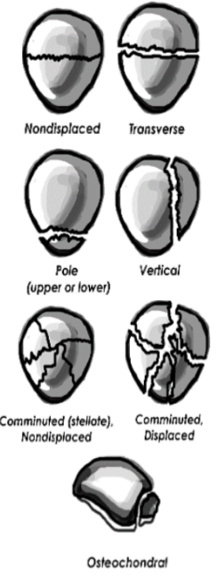

---

title: Knee Injuries - Patellar Fracture
authors:
    - Layla Abubshait, MD
    - Michael Gottlieb, MD, RDMS
    - Mary Haas, MD
created: 2016/11/21
updates:
categories:
    - Orthopedics
---

# Knee Injuries: Patellar Fracture

## X-ray Views

- AP knee
- Lateral knee: Best to assess for fracture displacement
- Patella view: (sunrise or Merchant)

## Acute Management

- Knee immobilizer with knee in full extension
- Weight-bearing instructions as tolerated

**If Non-operative:** Early weight bearing to minimize bone loss and muscle atrophy

## Follow-up Timing

Within 1 week

**If Non-operative:**

- Muscle strengthening education
- Likely conversion to long leg cast or locking knee brace

## Notes

Operative Indications

- Knee extensor function disruption
- \> 2 mm articular displacement
- \> 3 mm fracture fragment separation

Possible complications:

- Nonunion
- Stiffness
- Muscle atrophy
- Osteonecrosis

## References

- [Schwartz A. Patella Fractures Treatment & Management, Emedicine.com (June 2016)](http://emedicine.medscape.com/article/1249384-treatment).

- [Hinton RY, Sharma KM. Acute and recurrent patellar instability in the young athlete. Orthop Clin North Am. 2003 Jul;34(3):385-96.](https://www.ncbi.nlm.nih.gov/pubmed/?term=12974488)

- [Ji G, et al . Surgical versus Nonsurgical Treatments of Acute Primary Patellar Dislocation with Special Emphasis on the MPFL Injury Patterns. J Knee Surg. 2016 Sep 14. Epub ahead of print.](https://www.ncbi.nlm.nih.gov/pubmed/?term=27626368.)

- [Petri M, et al. Current Concepts for Patellar Dislocation. Arch Trauma Res. 2015 Sep 1;4(3):e29301.](https://www.ncbi.nlm.nih.gov/pubmed/?term=26566512)

- [Medina O, et al. Vascular and nerve injury after knee dislocation: a systematic review. Clin Orthop Relat Res. 2014 Sep;472(9):2621-9.](https://www.ncbi.nlm.nih.gov/pubmed/?term=24554457)
