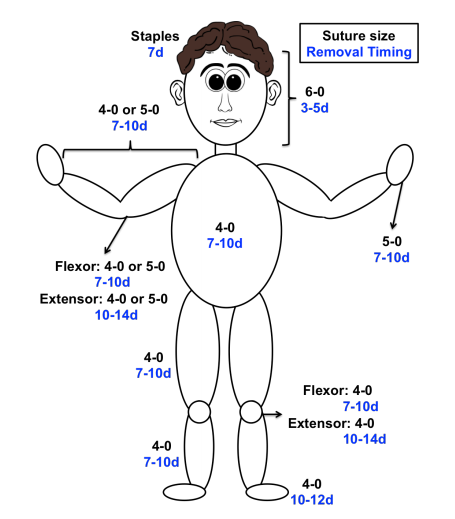

# Laceration Repair and Sutures – A cheat sheet guide

| **SUTURE TYPE**     | **Time of Effective Tensile Strength**  |  **Time to Absorption** | **Reactivity**  |
|---------------------|-----------------------------------------|-------------------------|-----------------|
| Prolene             | indefinite                              | non absorbable          | low             |
| Nylon               | gradual loss                            | non absorbable          | low             |
| Silk                | gradual loss                            | non absorbable          | high            |
| Fast absorbing gut  | 7 days                                  | 21-42 days              | high            |
| Vicryl Rapide       | 5-14 days                               | 42 days                 | high            |
| Monocryl            | 7-14 days                               | 91-119 days             | high            |
| Vicryl              | 14-28 days                              | 56-70 days              | high            |
| Chromic Gut         | 21-28 days                              | 90 days                 | high            |

| **LOCATION**              | **CONCERN**                                                         | **TREATMENT**                                                                                                                                                                                       |
|---------------------------|---------------------------------------------------------------------|-----------------------------------------------------------------------------------------------------------------------------------------------------------------------------------------------------|
| Eyelid margin             |    Requires careful approximation                                   | Ophthalmology consult for repair                                                                                                                                                                    |
| Medial canthus of eye     |    Lacrimal duct location                                           | Ophthalmology consult for repair                                                                                                                                                                    |
| Vermillion border of lip  |    Requires careful approximation                                   | Consider consulting Oral Maxillofacial Surgery or Plastics                                                                                                                                          |
| Mammalian bites           |    Risk for infection, especially of the hands: Human > Cat > Dog   | **Antibiotics:** Amoxicillin-clavulanate (Cochrane: Antibiotics not warranted for uncomplicated dog bites to non-hand areas of the body [1].)  Do not close wounds, especially if puncture-like. |

## References
- Medeiros I, Saconato H. Antibiotic prophylaxis for mammalian bites. Cochrane Database Syst Rev.
2001;(2):CD001738. [[PubMed](https://www.ncbi.nlm.nih.gov/pubmed/?term=11406003)]
- Capella O, Hollander JE. Management of lacerations in the emergency department. Emerg Med
Clin N Am. 2003; 21:205-231. [[PubMed](https://www.ncbi.nlm.nih.gov/pubmed/?term=12630738)]
- DeBoard RH, Rondeau DF, Kang CS, Sabbaj A, McManus JG. Principles of basic wound evaluation
and management in the emergency department. Emerg Med Clin N Am. 2007; 25:23-39. [[PubMed](https://www.ncbi.nlm.nih.gov/pubmed/?term=17400071)]
- Lammers RL, Smith ZE. Methods of wound closure. In: Roberts and Hedges’ Clinical Procedures in
Emergency Medicine, 6th Ed. Saunders. 2013. 644-689.
