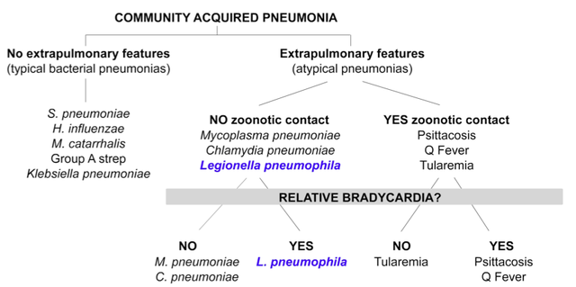

---

title: Legionnaire''s Disease
authors:
    - Michelle Lin, MD
created: 2011/09/16
updates: null
categories:
    - Infectious Disease
    - Pulmonology
---

# Legionnaire's Disease

Pneumonia caused by any _Legionella_ species

**Background**

- Outbreaks related to exposure to colonized water
- Air travel
- Water puddles
- Excavation
- Construction sites
- Most commonly found in patients age > 50 years, smokers, immunocomprised
- DDx often involves other atypical pneumonia and zoonotic organisms 
- Requires reporting to your state's health department to help track for outbreaks.

## Clinical Presentation

Acute presentation of severe community acquired pneumonia (CAP) 

**Classic CXR:** Rapidly progressive asymmetrical patchy infiltrates

- The DDx for such a CXR finding includes: 
  1. _Strep pneumoniae_ in patients with impaired splenic function 
  2. Legionella
  3. Zoonotic atypical pathogens (Q fever, tularemia, adenovirus)

Extrapulmonary organ involvement:

- **CNS:** Mental confusion, encephalopathic, headache
- **Cardiac:** Relative bradycardia
- **GI:** Loose stools/watery diarrhea
- **Renal:** Microscopic hematuria, renal insufficiency 

| Temperature    | Appropriate HR (bpm) | Relative Bradycardia (bpm) |
| -------------- | -------------------- | -------------------------- |
| 102°F (38.9°C) | 110                  | &lt; 100                   |
| 103°F (39.4°C) | 120                  | &lt; 110                   |
| 104°F (40.0°C) | 130                  | &lt; 120                   |
| 105°F (40.6°C) | 140                  | &lt; 130                   |

## Classic Laboratory Findings

- **Na:** Low in CAP but mostly frequently associated with Legionella 
- **AST/ALT:** Mildly increased 2-5x normal
- **Phosphate:** Decreased
- **CK:** Increased
- **CRP:** > 35
- **Ferritin:** Increased > 2x normal 

## Legionella Diagnostic Triad

| **Entry Criteria (Need all 3)** | **Key Clinical Feature**                              | **Key Lab Features (Any 3)** |
| ------------------------------- | ----------------------------------------------------- | ---------------------------- |
| Signs/sx of CAP                 | Fever > 102F with  unexplained  relative bradycardia  | Hypophophatemia              |
| New infiltrate on CXR           |                                                       | Ferritin> 2x normal          |
| No zoonotic contact hx          |                                                       | Mild transaminitis           |
|                                 |                                                       | Relative lymphopenia         |

[(](http://www.ncbi.nlm.nih.gov/pubmed/?term=20457348)[Cunha et al., Infect Dis Clin N Am. 2010](http://www.ncbi.nlm.nih.gov/pubmed/?term=20171547))

## Diagnostic Test

- Urine Legionella antigen: although only detects serotypes 1-6

## Antibiotic Treatment

- **Macrolides:** First-line agent, although a growing resistance
- Other antibiotics: Doxycycline, fluoroquinolones 
- Duration of treatment: 2 weeks

## References

- Cunha BA, Mickail N, Syed U, Strollo S, Laguerre M. Rapid clinical diagnosis of Legionnaires' disease during the "herald wave" of the swine influenza (H1N1) pandemic: the Legionnaires' disease triad. Heart Lung. 2010 May-Jun;39(3):249-59. [PubMed](http://www.ncbi.nlm.nih.gov/pubmed/?term=20457348)
- Cunha BA. Legionnaires' disease: clinical differentiation from typical and other atypical pneumonias. Infect Dis Clin N Am. 2010;24(1):73-105. [PubMed](http://www.ncbi.nlm.nih.gov/pubmed/?term=20171547)
