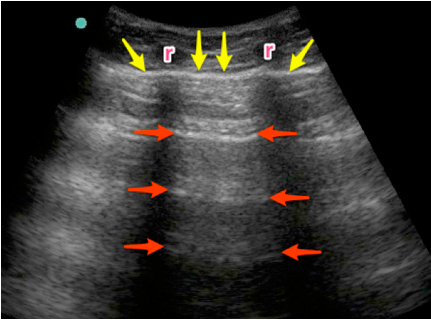
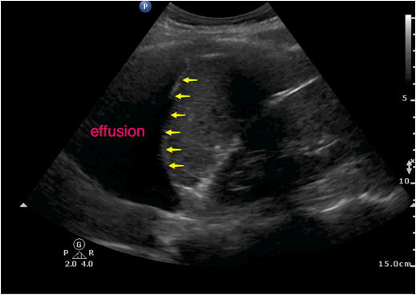
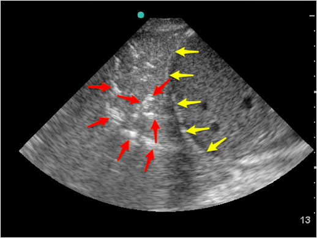

---

title: 'Focused Lung Assessment'
authors:
    - 'Anne Aspler, MD'
    - 'Clare Heslop, MD'
    - 'Mike Stone, MD'
created: 2015/02/04
updates: null
categories:
    - Ultrasound
    - Radiology
    - Pulmonology
drugs: null

---

# Ultrasound: Focused Lung Assessment

**Goals:** Evaluate for lung sliding, lung artifacts (A and B lines), consolidation, and pleural effusion

**Transducer:** Performance and interpretation of lung US is not transducer-specific:

-   Low frequency curvilinear (or phased array) transducer allows adequate depth to assess artifacts (A lines and B lines).
-   High frequency linear transducer may be used to better visualize lung sliding at the pleura, if there is uncertainty with the low frequency curvilinear transducer.

**Windows:** Transducer orientation is longitudinal with directional indicator oriented towards the patient’s head. The area of interest is the pleura visualized between the ribs. There are many accepted scanning approaches, and two commonly used in the ED:

1.  **Three views in each hemithorax:**
    - **Anterior:** 2nd or 3rd interspace at the mid-clavicular line.
    - **Anterolateral:** Anterior and mid- axillary lines along the 3rd to 5th interspace.
    - **Posterolateral:** Posterior axillary line, looking into the lower thorax and upper abdominal quadrants at the level of the diaphragm.

2.  **8 lung zones**, or 4 sections, in each hemithorax [Volpicelli]:

Figure 1: Transducer positions for the 8 lung zones

## Lung Sliding

The visceral and parietal pleura appear as a single hyperechoic line deep to the internal intercostal muscle, and in healthy lungs will "slide" during the respiratory cycle.

Absent lung sliding is a ***pathologic finding*** found in pneumothorax, contralateral mainstem bronchus intubation or esophageal intubation (lung pulse present), pleural adhesions, stiff lungs, and pleurodesis.

## A-Lines

-   **Horizontal** reverberation artifacts
-   Arise from the pleural line, are hyperechoic and parallel to pleural surface at equal intervals.
-   Seen with normal lung aeration and in some cases of pneumothorax

Figure 2: **A-lines **are visualized as hyperechoic, horizontal artifacts at regular intervals deep to the **pleural line.** Note the ribs **(r)** in the near field.

## B-Lines

-   **Vertical** artifacts
-   Arise from the pleural line, extend off the screen without fading, are hyperechoic and laser-like, move with respiration, and erase the normal A-line pattern.
-   More than 3 B-lines in an interspace is considered ***pathologic***, although many experts agree that any anterior B-lines are pathologic.

Figure 3: **B-lines **are visualized as hyperechoic vertical artifacts arising from the **pleural line** and extending off the screen without fading, erasing the A-line pattern.

## Comet Tails

-   A normal artifact
-   **Vertical** artifact that looks like B-lines, but are distinguished from them by their depth of extension. They do NOT extend to the bottom of the screen NOR erase A-Lines.

## Lung Profiles

**Normal Lung:** Lung sliding present at pleural line. A-lines. B-lines may occur postero-laterally, but never more than 3 in a single interspace.

**Pneumothorax**: Absent lung sliding, no B-lines. A-lines are present. A lung point, representing the boundary of the pneumothorax and adjacent inflated lung, may be identified.

**Pneumonia:** Focal area of B-lines, asymmetric compared to contralateral lung. Consolidation with dynamic air bronchograms may be visualized (see below). Lung sliding may be absent due to inflammation causing pleural adherence, or decreased regional ventilation.

**Interstitial Syndromes** (pulmonary edema, ARDS, pneumonitis): Greater than three B-lines in 2 or more interspaces.

**Pleural** **Effusion**: Subpleural collection seen in dependent regions, usually anechoic but may be hypo- or iso-echoic if exudative, and may have hyperechoic septae.

**Consolidation or Atelectasis:** Lung tissue appears as a subpleural tissue-like texture, without lung sliding or air artifacts.

## Pleural Effusion

Figure 4: **Pleural effusion** visualized as an anechoic fluid collection located cephalad to the (arrows).

## Pneumonia

Figure 5: A lobar consolidation located cephalad to the **diaphragm.** The branching, **hyperechoic air bronchograms** define this consolidation.

## Struggling with the Exam?

- Do ***not*** move quickly. Hold the probe STILL during the respiratory cycle to see lung sliding and lung artifacts. Compare the same region of each hemithorax sequentially instead of the entire hemithorax at once.

**Can’t decide if there is lung sliding?**

- To optimize visualization of the pleural line, decrease the depth and decrease the overall gain.

**Can’t see A-lines or B-lines?**

- Turn *off* artifact-reduction settings, or use a lung preset if available. Keep the transducer perpendicular to the patient’s chest in all zones scanned. Use a low-frequency transducer set to its lowest operating frequency.

## Common Errors:

**Unable to identify A-lines:** 

- Remember to turn *off* artifact-reduction settings, or use a lung preset if available. Keep the transducer perpendicular to the patient’s chest in all zones scanned.

**Quantification of B-lines:** 

- A single B-line in dependent interspaces may be a normal finding in a healthy patient, but &gt;3 B-lines in a single interspace indicates lung pathology.

**Absence of lung sliding** is 100% sensitive for pneumothorax, but is ***not specific*** to pneumothorax. 

- Other possibilities may be failure to ventilate, contralateral mainstem intubation, dense consolidation from pneumonia, severe pulmonary fibrosis, or pleural inflammatory changes.

## References

- Blaivas M, et al. *Acad Emerg Med*, 2005. PMID: [16141018](http://www.ncbi.nlm.nih.gov/pubmed/16141018)
- Liteplo AS, et al. *Acad Emerg Med*, 2009. PMID: [19183402](http://www.ncbi.nlm.nih.gov/pubmed/19183402)
- Volpicelli G. *J Ultrasound Med*. 2013. PMID: [23269722](http://www.ncbi.nlm.nih.gov/pubmed/23269722)
