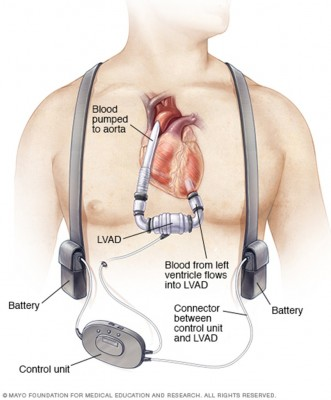
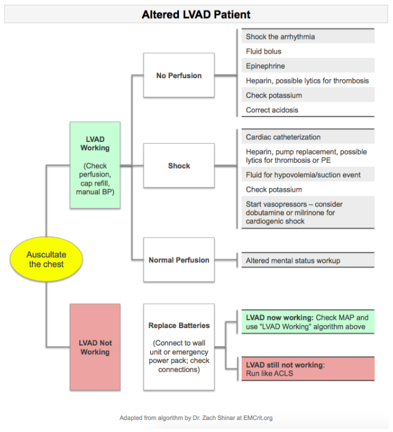

---

title: Left Ventricular Assist Device Complications
authors:
    - Nicolas Stadlberger, MD
created: 2016/11/23
updates:
categories:
    - Cardiovascular
    - Critical Care
---

# Left Ventricular Assist Device Complications

- These patients MAY NOT HAVE A PULSE    
- May need ABG since pulse ox maybe inaccurate without pulse
- Contact your hospital’s or network’s LVAD Coordinator immediately to help with management and troubleshooting.
- Patients are usually on diuretics, and may intravascularly depleted or have electrolyte abnormalities

## LVAD Patient in Extremis: Step-Wise Diagnostic Approach

### Step 1

- Address airway, breathing, circulation; Obtain IV, O2, monitor
- Measure blood pressure: May need manual cuff with Doppler to obtain mean arterial pressure (MAP), or use arterial line (MAP goal 70-80 mmHg)
- Assign someone to call LVAD Coordinator

### Step 2

- **A**uscultate precordium. Is there a hum?
    − Yes? LVAD is working. No? LVAD is not working.
- **B**attery: Make sure it is plugged in.
- **C**ontroller – Check for alarms.
- **D**riveline – Check device type, evidence of infection/damage
- **E**chocardiogram

### Step 3

- Obtain VAD variables: Flow, Power, Speed, Pulsatility Index

### Step 4

- Obtain ECG
- Obtain labs:
  - CBC
  - electrolytes
  - coagulation studies
  - LDH
  - type and screen given GI bleed risk
  - ± blood cultures for infection concern
  - ± ABG

## Echocardiogram Findings - Causes & Management

### Big right ventricle, big left ventricle

**Potential Causes**

- Pump failure
- Pump thrombosis
- Valve disorders

**Management**

- Heparin
- antiplatelet agents
- thrombolytics

### Big right ventricle, small left ventricle

**Potential Causes**

- Right heart failure
- ST-elevation MI
- Pulmonary hypertension
- Note: If LV to outflow cannula size ratio is 1:1, then high risk for suction event

**Management**

- IV fluids
- ECG
- consider inotropes

### Small right ventricle, small left ventricle

**Potential Causes**

- Hypovolemia
- Sepsis
- GI bleed

**Management**

- IV fluids
- consider blood transfusion
- antibiotics

## LVAD Complications

### Arrhythmia

Up to 50% with sustained VT/VF in first 4 weeks after LVAD placement

Difficult to determine primary vs. secondary cause:

- Primary: compromised myocardium + scar tissue
- Secondary: electrolyte abnormalities, hypotension, suction events

Management Depending on the cause:

- IV fluid challenge is reasonable
- Reduce pump speed
- Correct electrolytes
- Electrical or pharmacologic: amiodarone, cardioversion

### Infection

Up to 42% experience sepsis within 1 year (REMATCH Study). Most infections are in first 3 months. 9% are fungal.

Treat with Broad spectrum antibiotics + antifungal

### Thrombus (pump thrombus, PE, stroke/TIA)

High risk despite anticoagulation. Pump thrombus suggested by warm device and increased power output. Elevated LDH.

Treat with Heparin, thrombolytics, antiplatelet agents.

### Bleeding

Patients may have an acquired Von Willebrand Disease coagulopathy.

If life-threatening, reverse anticoagulation and transfuse as needed.

### Suction Event

> An underfilled LV causing suction of myocardium into LVAD)

Can be caused by right heart failure, hypovolemia, sepsis, restrictive cardiomyopathy, arrhythmias.

Treat with IV fluids to increase LV filling.

### RV Failure

Due to acute myocardial infarction (AMI) or previous RV failure

Treat with IV fluids and consider inotropes. Aspirin and heparin if AMI.

### Cannula Malposition

Consider in setting of new VT, suction event, chest compressions, or trauma.

Requires surgical exploration.

### Device Malfunction, Pump Failure

Suggested if no hum and mean arterial pressure (MAP) &lt;40 mmHg.

Treat cardiogenic shock: IV fluids, vasopressors, ACLS protocols, consider heparin for thrombosis.

### Cardiac Arrest

Multiple potential causes including all those listed above.

ACLS algorithms except:

- Chest compressions are controversial as they could dislodge the device.
- Do NOT place defibrillation pads directly over device.
- Assign one person to assess device placement during and after code.

## Altered LVAD Patient

## References

- [Partyka C, Taylor B. Review article: ventricular assist devices in the emergency department. Emerg Med Australas. 2014;26(2):104-112.](https://www.ncbi.nlm.nih.gov/pubmed/24707998)
- [Andersen M, Videbaek R, Boesgaard S, Sander K, Hansen P, Gustafsson F. Incidence of ventricular arrhythmias in patients on long-term support with a continuous-flow assist device (HeartMate II). J Heart Lung Transplant. 2009;28(7):733-735.](https://www.ncbi.nlm.nih.gov/pubmed/19560703)
- [Greenwood J, Herr D. Mechanical circulatory support. Emerg Med Clin North Am. 2014;32(4):851-869.](https://www.ncbi.nlm.nih.gov/pubmed/25441039)
