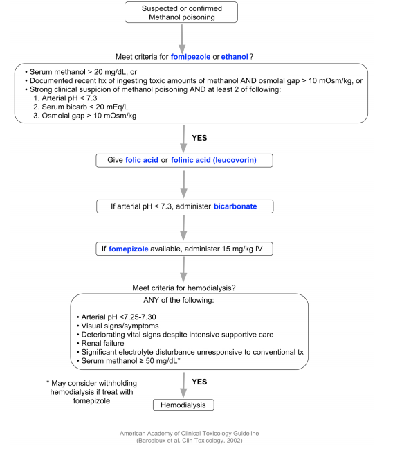
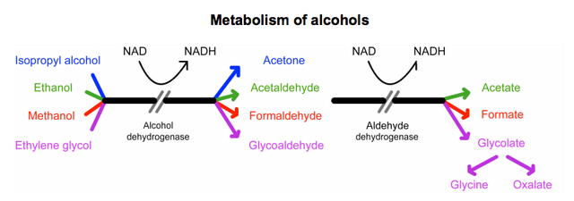

# Toxic Alcohol Ingestion: Methanol

General concepts for all 3 toxic alcohols:

- Parent compounds (not metabolites) cause high osmolal gap
- When NAD depleted, pyruvate converts to lactate - which then causes lactic acidosis
- See metabolism of alcohols diagram below

## Methanol: Factoids

Solvent found in cleaning and printing solutions, adhesives, stains, paint removers, antifreeze agent in windshield wiping fluid, camp stove fuel, gasoline additive

**Pharmacology**:

- Peak serum concentration 30-60 minutes, elimination half-life 12-20 hours
- Permanent blindness reported at as little as 0.1 mL/kg (6-10 mL in adults)
- Lethal dose = 1-2 mL/kg
- Metabolite (eg. formic acid) causes toxicity, but does NOT cause osmolal gap

## Methanol: Classic Presentation 

<table>
<colgroup>
<col width="100%" />
</colgroup>
<tbody>
<tr class="odd">
<td><em>Classic Presentation</em> 

<ul>
<li>AMS 
</li>
<li>Visual sx  
</li>
<li>Abdominal pain 
</li>
<li>High anion gap metabolic acidosis 
</li>
<li>High osmolal gap 
</li>
</ul></td>
</tr>
</tbody>
</table>

- **CNS:** Headache, lethargy, confusion, Parkinsonian extrapyramidal symptoms
- **Ocular:** Blurry vision, central scotoma, impaired pupillary response, photophobia, retinal edema (permanent damage in 25-33% of patients)
- **GI:** Vomiting, abdominal pain, pancreatitis

## Methanol: Stages of Presentation

| **Stage**                    | **Clinical findings**                            |
| ---------------------------- | ------------------------------------------------ |
| Early                        | Mild euphoria, inebriation, drowsiness           |
| Latent (lasting 6-30 hours)  | Normal sensorium but blurred vision              |
| Late                         | Severe systemic toxicity with worsening acidosis |

## Methanol: Management

**Goal:** Prevent further formation of formic acid (using fomepizole) and eliminate toxic metabolites (through dialysis) 

- Folic or folinic acid supplementation to enhance formate metabolism
- **Antidote:** Fomipezole inhibits alcohol dehydrogenase (alternative = ethanol)

| **Fomipezole**   | **Dosing**                          |
| ---------------- | ----------------------------------- |
| Loading dose     | 15 mg/kg IV                         |
| Maintenance dose | 10 mg/kg IV every 12 hours x 2 days |

## Methanol: American Academy of Clinical Toxicology guidelines

## Metabolism of alcohols

## References

- Jammalamadaka D, Raissi S. Ethylene glycol, methanol and isopropyl alcohol intoxication. Am J Med Sci. 2010 Mar;339(3):276-81. doi: 10.1097/MAJ.0b013e3181c94601. [PubMed](https://www.ncbi.nlm.nih.gov/pubmed/?term=20090509)
- Kraut JA, Kurtz I. Toxic alcohol ingestions: clinical features, diagnosis, and management. Clin J Am Soc Nephrol. 2008 Jan;3(1):208-25. Epub 2007 Nov 28. [PubMed](https://www.ncbi.nlm.nih.gov/pubmed/?term=18045860)
- Marraffa JM, Cohen V, Howland MA. Antidotes for toxicological emergencies: a practical review. Am J Health Syst Pharm. 2012 Feb 1;69(3):199-212. doi: 10.2146/ajhp110014 [PubMed](https://www.ncbi.nlm.nih.gov/pubmed/?term=22261941)
- Barceloux DG, Bond GR, Krenzelok EP, Cooper H, Vale JA; American Academy of Clinical Toxicology Ad Hoc Committee on the Treatment Guidelines for Methanol Poisoning. American Academy of Clinical Toxicology practice guidelines on the treatment of methanol poisoning. J Toxicol Clin Toxicol. 2002;40(4):415-46. [PubMed](https://www.ncbi.nlm.nih.gov/pubmed/?term=12216995)
