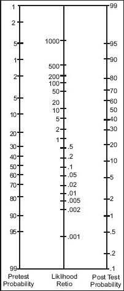

---

title: Paracentesis for Ascites
authors:
    - Michelle Lin, MD
created: 2010/06/25
updates: null
categories:
    - Gastroenterology

---

# Spontaneous Bacterial Peritonitis and Paracentesis

*[JAMA Rational Clinical Examination Series 2009](http://www.ncbi.nlm.nih.gov/pubmed/?term=18926597)*

**Bottom line:** It appears safe to perform paracentesis without checking coagulation labs

-   2 prospective studies
-   No instances of significant bleeding despite platelet counts &lt;50K and INR &gt;1.5
-   2 cases of minor bleeding

**Bottom line:** Albumin likely not needed in therapeutic paracentensis

-   9 prospective randomized studies
-   Pooled 806 paracentesis procedures: No difference with plasma expansion with respect to encephalopathy and death. 

## Spontaneous Bacterial Peritonitis (SBP) Lab Findings

-   Ascites WBC &gt;500 cells/mm3
-   Ascites PMN &gt;250 cells/mm3
-   Ascites pH &lt;7.35
-   Blood-ascites pH gradient &gt;0.1 

## Ascites fluid analysis to assess for SBP (pooled data)

| **Lab Finding**                 | **# patients** | ** (+) LR** | **(-) LR** |
|---------------------------------|:-----------------:|:-----------------:|:-----------------:|
| Ascites WBC &gt;1000 cells/mm3 | 508             | 9.1             | 0.25            |
| Ascites WBC &gt;500 cells/mm3  | 717             | 5.9             | 0.21            |
| Ascites PMN &gt;500 cells/mm3  | 1,074           | 10.6            | 0.16            |
| Ascites PMN &gt;250 cells/mm3  | 1,058           | 6.4             | 0.2             |
| Ascites pH &lt;7.35            | 129             | 9.0             | 0.31            |
| Blood-Ascites pH gradient       | 129             | 7.1             | 0.30            |

## Fagan Nomogram

## References

-   [Wilkerson RG, Sinert R.Evidence-based emergency medicine/rational clinical examination abstract: The use of paracentesis in the assessment of the patient with ascites. Ann Emerg Med. 2009 Sep;54(3):465-8. doi: 10.1016/j.annemergmed.2008.09.005. Epub 2008 Oct 16.](http://www.ncbi.nlm.nih.gov/pubmed/?term=18926597)
