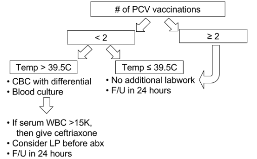

---

title: Pediatric Fever Without a Source - Over 3 Months
authors:
    - Christine Cho, MD
created: 2012/02/09
updates: null
categories:
    - Pediatrics

---

# Pediatric Fever Without a Source - 3 months to 3 years

- Fever that should prompt workup in this age group: T ≥39.0&deg; C / 102.2&deg;F
- Fever still defined as T ≥ 38&deg;C / 100.4&deg;F
- Named viral infections DO count as a source, such as: HSV gingivostomatitis, Coxsackie hand-foot-mouth, RSV bronchiolitis (although UTI may present concurrently with RSV)
- Unnamed, nonspecific viral infections MAY be considered a source for vaccinated, well-appearing child (especially with sick contacts)

## Background

Serious bacterial infection (SBI) includes:

- Occult bacteremia: Most commonly Strep pneumoniae
- Meningitis: <0.03% risk in post-PCV7 vaccination era. Clinical exam is helpful.
- UTI: 60-65% of febrile UTI patients have pyelonephritis
- Pneumonia: Most common pathogens are viruses in post-PCV7 era
- Also: Gastroenteritis, osteomyelitis, septic arthritis, soft tissue infection

## Workup Guidelines (if nontoxic appearing)

### Girls

- Urinalysis
- Urine culture

### Boys

| Age           | Circumsised           | Uncircumcised         |
|---------------|-----------------------|-----------------------|
| &le; 6 months | *consider* urinalysis and urine culture | urinalysis, urine culture |
| 6-12 months   | no urine studies      | *consider* urinalysis and urine culture |
| &gt; 12 months | no urine studies     | no urine studies |

### Number of Pneumococcal conjugate vaccines (PCV)

## References

- Christine Cho, lecture presentation: http://lecture.ucsf.edu/ets/Play/b1d49de0f7f4407994c44a791b2223321d

