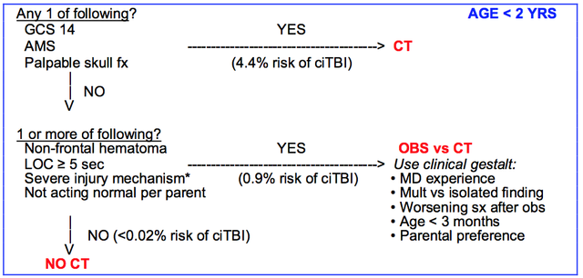
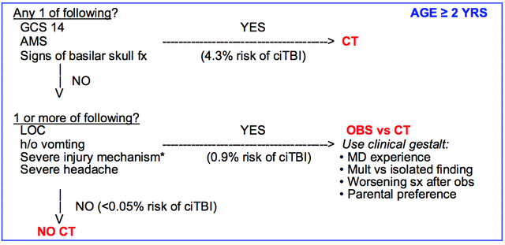

# Pediatric Blunt Head Trauma (PECARN Study)

Risk of CT-documented TBI in children GCS &lt;14 = 20% 

## PECARN Study

- Derivation (n = 33,785) and validation (n = 8,627) of clinical decision rule for deciding who NOT to get head CTs for blunt head trauma
- Enrolled age &lt;18 yr within 24 hrs of head trauma and GCS 14-15
- Patients from 25 enrolling Emergency Departments

**“Clinically important traumatic brain injury” (ciTBI)** predefined as:

- Death from TBI
- Intubation >24 hours duration
- Neurosurgical intervention
- Hospital admission &ge;2 nights

## PATIENT AGE &lt;2 Years 

**Severe Injury Mechanism**

- MVC with patient ejection, death of another passenger, or rollover
- Pedestrian or bicyclist without helmet struck by a motorized vehicle
- **FALL >3 ft**
- Head struck by a high-impact object

## PATIENT AGE &ge;2 years

**Severe Injury Mechanism**

- MVC with patient ejection, death of another passenger, or rollover
- Pedestrian or bicyclist without helmet struck by a motorized vehicle
- **FALL >5 ft**
- Head struck by a high-impact object

## References

- Kuppermann N et al. ID of children at very low risk of clinically-important brain injuries after head trauma: a prospective cohort study. Lancet. 2009 Oct 3;374(9696):1160-70. [[PubMed](http://www.ncbi.nlm.nih.gov/pubmed/19758692)]
