---

title: 'Pediatric Weight-Based Resuscitation Reference'
authors:
    - 'Michelle Lin, MD'
created: 2010/10/23
updates: null
categories:
    - 'Critical Care'
    - Pediatrics
drugs: null

---

# Pediatric Weight-Based Resuscitation Reference

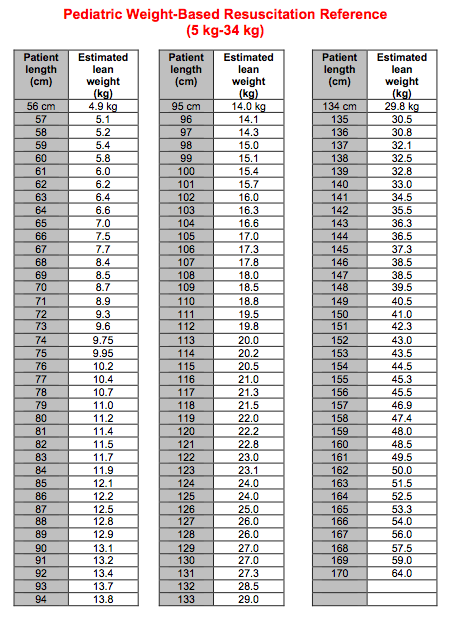

## 5 kg

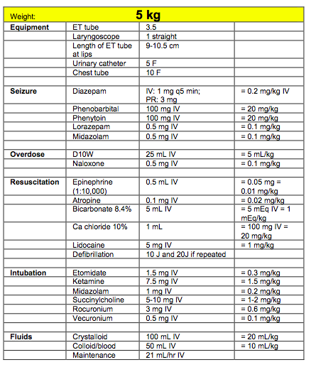

## 6 kg

## 7 kg

## 8 kg

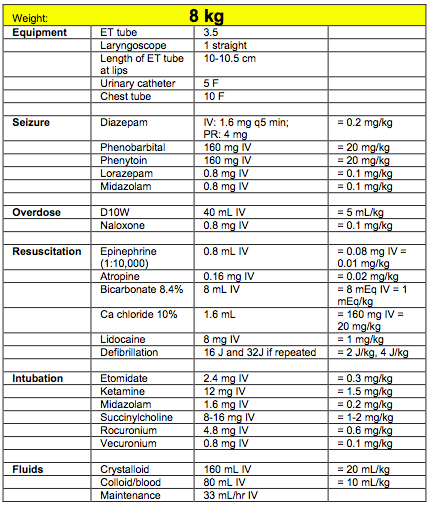

## 9 kg

## 10 kg

## 11 kg

## 12 kg

## 13 kg

## 14 kg

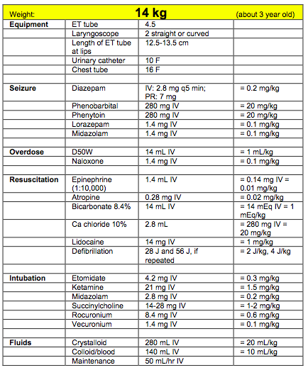

## 15 kg

## 16 kg

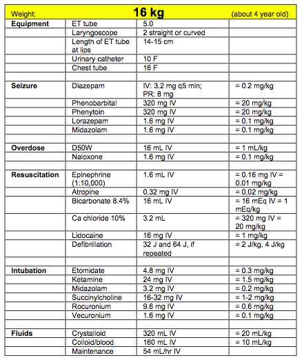

## 17 kg

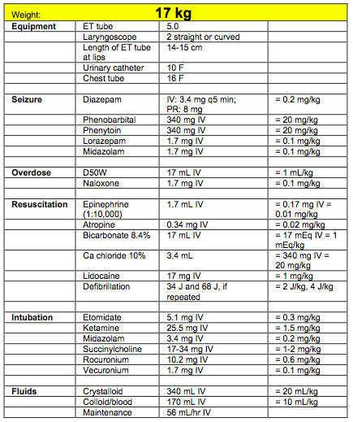

## 18 kg

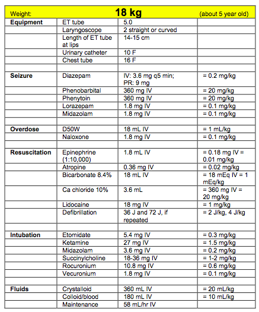

## 19 kg

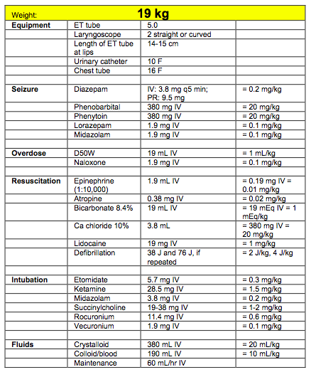

## 20 kg

## 21 kg

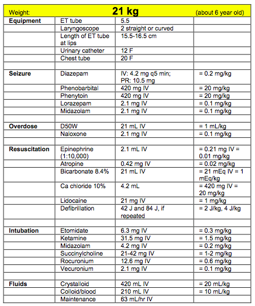

## 22 kg

## 23 kg

## 24 kg

## 25 kg

## 26 kg

## 27 kg

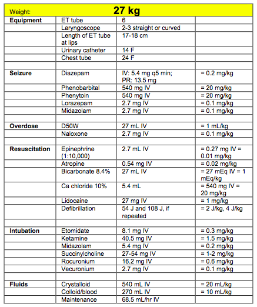

## 28 kg

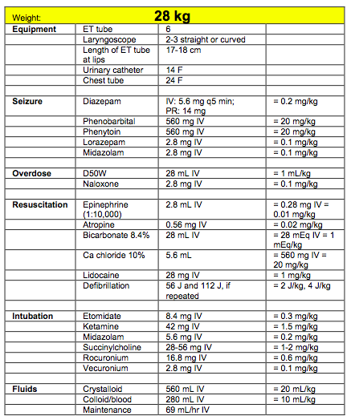

## 29 kg

## 30 kg

## 31 kg

## 32 kg

## 33 kg

## 34 kg

