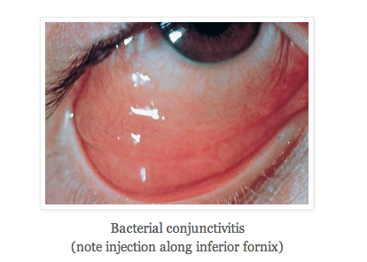
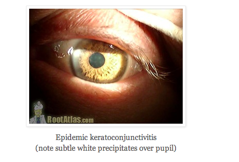
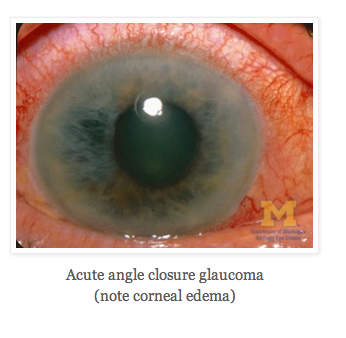

# Red Eye

There is significant overlap among conditions that cause a red, painful or red and painful eye. Here are additional cards that may help in your evaluation:

- [Eye Differential Diagnoses](/cards/eye-ddx)
- [Painful Eye](/cards/eye-painful)

## Conjunctivitis

### Allergic

- IgE mediated, usually associated with itching
- **Treatment:** Cold compresses, over-the-counter topical vasoconstrictors, histamine-blocking eyedrops

### Viral

- Most common form of infectious conjunctivitis (usually adenovirus)
- Preauricular lymphadenopathy, global conjunctival injection
- Watery discharge
- Follicular reaction of inferior tarsal conjunctiva
- **Treatment:** Cold compresses, artificial tears, topicaldecongestants, +/- topical antibiotics, if not able to discern from bacterial etiology

### Viral: Epidemic keratoconjunctivitis

- Adenovirus
- **Symptoms:** Eye pain, decreased visual acuity
- **Findings:** Corneal subepithelial infiltrates (1-2 mm gray-white crumb-like defects)

### Viral: HSV conjunctivitis

- More prevalent in HIV patients
- Foreign body sensation in eye (unlike typical viral conjunctivitis)
- **Treatment**:
  - If no skin or corneal involvement, topical antivirals (trifluridine or vidarabine) x 10-14 days
  - If corneal involvement (dendrites seen), topical trifluridine and oral acyclovir x 7-10 days. NO STEROIDS. 

### Viral: HZV ophthalmicus

VZV virus: Reactivation through V1 nerve 

Findings:

- Hutchinson sign: Herpes pustules at nose tip and is predictive of ocular involvement 
- Dendrites on eye exam
- **Treatment:** Systemic vs topical antiviral agents, +/- steroids only with ophthalmology consult

### Bacterial 

- Often association with morning crusting 
- Injection more pronounced at fornices
- **Contact lens wearer**: Pseudomonas risk
  - **Treatment:** Topical fluoroquinolone, cycloplegic

**Gonorrheal conjunctivitis:** 
- Sexually active patients and neonates (from birthcanal)
- “hyperacute conjunctivitis”, abrupt onset
- copious purulent discharge
- **Treatment:** Topical antibiotics, usually with systemic antibitics because associated with venereal disease

**Inclusion or Chlamydial conjunctivitis:** 
- Sexually active patients and neonates
- mucopurulent discharge
- foreign body sensation
- Check for concurrent sexually transmitted infections (symptomatic only 1⁄2 patients).
- **Treatment:** Topical erythromycin and po azithromycin x 1 

## Subconjunctival Hemorrhage

- In setting of trauma and large hemorrhage, consider globe rupture
- **Treatment:** Warm compresses, lubrication drops 

## Episcleritis

- Episclera: Thin membrane over the sclera and beneath conjunctiva
- Benign self-limited inflammatory cond with focal area of dilated episceral vessels 
- Seen with rheumatoid arthritis, polyarteritis nodosa, lupus, inflam bowel disease, sarcoid, Wegener’s, gout, herpes zoster virus, syphilis 
- **Treatment:** Oral NSAIDs

## Scleritis

- **Most common immune cause:** Rheumatoid arthritis
- **Most common vasculitis cause:** Wegener’s 
- **Symptoms:** Severe eye pain radiating to ear, scalp, face, and jaw. Dull pain. Photophobia. 
- **Exam:** Deep episcleral plexus is vascularly engorged – appears blue-violet, vessels non-blanching with vasoconstrictor, scleral edema 
- **Treatment:** 
  - Oral NSAIDs 
  - Consider oral steroids, but with ophthalmology consultation 

## Uveitis

- Divided into anterior (iris, ciliary body) vs posterior (retinochoroiditis)
- **Etiologies:** Inflammatory (50% assoc w/ systemic inflam disease), traumatic, infectious 
- Consider CMV in posterior uveitis in HIV patients
- **Anterior uveitis:** Sudden, severe, painful eye; photophobia; perilimbal injection, consensual photophobia from unaffected eye
- **Posterior uveitis:** “Floaters”, flashing light – no redness or pain
- **Exam:** Inflammatory cells, proteinaceous flare
- **Complications:** Cataracts, glaucoma, retinal detachment
- **Treatment:** 
  - Mydriatic or cycloplegic drops 
  - Consider oral steroids, but with ophthalmology consult 

## Acute Angle Closure Glaucoma

- **Symptoms:** Blurred vision, halos around lights, nausea/vomiting, headache
- **Pearl:** Consider in all patients with “migraine HA’s” – check pupil reactivity
- **Exam:** Corneal edema, mid-dilated NON-reactive pupil
- Intraocular pressure >30 mmHg requires prompt treatment
- **Treatment:** 
  - Topicals: Timolol, prednisolone, apraclonidine
  - Oral: Acetazolamide 

## References

- Mahmood AR, Narang AT. Diagnosis and management of the acute red eye. _Emerg Med Clin North Am_. 2008 Feb;26(1):35-55, vi. [[PubMed](http://www.ncbi.nlm.nih.gov/pubmed/?term=18249256)]
