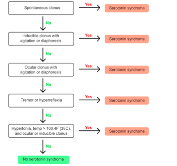

---

title: Serotonin Syndrome
authors:
    - Michelle Lin, MD
created: 2012/01/06
updates: null
categories:
    - Toxicology
---

# Serotonin Syndrome

**Classic findings:** Altered mental status + Autonomic instability + Neuromuscular hyperactivity.

## Medications contributing to serotonin syndrome

**Amphetamines and derivatives**

**Analgesics**

-   Cyclobenzaprine
-   Fentanyl
-   Meperidine
-   Tramadol

**Antidepressants/ mood stabilizers**

-   Buspirone
-   Lithium
-   MOA-I
-   SSRIs
-   SNRIs 
-   Serotonin 2A-R blockers
-   St. John’s wort
-   TCAs

**Antiemetics**

-   Metoclopramide 
-   Ondansetron

**Antimigraine medications**

-   Carbamazepine 
-   Ergots 
-   Triptans
-   Valproic acid

**Miscellaneous**

-   Cocaine
-   Dextromethorphan
-   Linezolid
-   L-tryptophan
-   5-hydroxytryptophan

**Tip:** Be especially aware of adding drug that inhibits cytochrome P450 2D6 +/- 3A4 (eg. erythromycin) to someone on SSRI.

**Treatment:** Usually supportive (benzodiazepines), although can give cyproheptadine (serotonin 2A antagonist) 

## Hunter's decision Rule 

(Sensitivity 84%, Specificity 97%)

## Sternbach's criteria

**Need 3 of 10 symptoms:** (Sensitivity 75%, specificity 96%)

-   Agitation or restlessness
-   Diaphoresis
-   Diarrhea
-   Hyperreflexia
-   Incoordination or ataxia
-   Confusion
-   Hypomania
-   Myoclonus
-   Shivering
-   Tremor 

**Differential Diagnosis:**

-   Anticholinergic syndrome
-   Neuroleptic malignant syndrome
-   Malignant hyperthermia 

Table adapted from [Boyer EW, Shannon M. NEJM 2005](http://www.ncbi.nlm.nih.gov/pubmed/15784664)

## References

-   [Boyer EW, Shannon M. The serotonin syndrome. N Engl J Med. 2005 Mar 17;352(11):1112-20. PMID: 15784664.](http://www.ncbi.nlm.nih.gov/pubmed/15784664)
-   [Ables AZ, Nagubilli R. Prevention, recognition, and management of serotonin syndrome.Am Fam Physician. 2010 May 1;81(9):1139-42.](http://www.ncbi.nlm.nih.gov/pubmed/?term=20433130)
