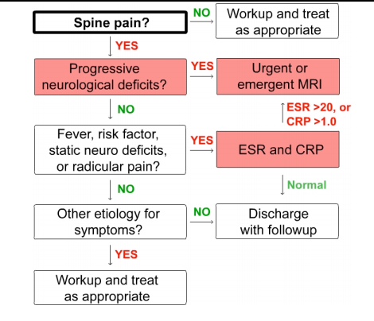

---

title: Spinal Epidural Abscess
authors:
    - Michelle Lin, MD
created: 2011/08/05
updates: null
categories:
    - Infectious Disease
    - EBM
---

# Spinal Epidural Abscess (SEA)

**Classic triad** (back pain + fever + neuro deficits) found in only 2-13% of SEA pts. [1](https://www.ncbi.nlm.nih.gov/pubmed/?term=15028325),[3](https://www.ncbi.nlm.nih.gov/pubmed/?term=21417700)

ESR test:

- If ESR >20, sensitivity=90% [1](https://www.ncbi.nlm.nih.gov/pubmed/?term=15028325).
- If ESR >30, sensitivity=81% [2].

**Diagnostic Guideline** ([Davis et al., 2011](https://www.ncbi.nlm.nih.gov/pubmed/?term=21417700))

**Study design:**

- Prospective cohort analysis of clinical decision guidelines to diagnose SEA 
- n = 86 patients (55 in 9-year control group, 31 in 5-year study group)

**Outcome measures:**

1. Diagnostic delays (multiple ED visits or admission to nonsurgical service without diagnosis of SEA
2. Presence of motor deficits at time of diagnosis

**Risk factors for SEA used in this study:**

- Diabetes
- IVDU history
- Chronic liver or kidney disease
- Recent spine procedure
- Indwelling spinal hardware
- Recent spine fracture
- Indwelling vascular catheter
- Immunocompromised
- Other site of infection

**Limitation:** 1/3 of physicians did NOT follow guidelines with ≥1 risk factor esp in setting of trauma and non-midline spine pain

**Results:** 

- **Diagnostic delays:** 84% without guidelines, 10% with guidelines (OR = 48)
- **Motor deficits at diagnosis:** 82% without guidelines, 19% with guidelines (OR = 19)
- **ESR:** Sensitivity = 100% and specificity = 67% if ≥1 SEA risk factor
- **ROC curve** better with ESR (0.96) than CRP (0.81)

## References

- Sidman RD, Delorie RC, Spitalnic SJ, Sucov A: Screening tests for spinal epidural abscess lack the sensitivity required to rule it out, Acad Emerg Med (abstract), 9(5):413-4, 2002.
- [Davis DP, Salazar A, Chan TC, Vilke GM. Prospective evaluation of a clinical decision guideline to diagnose spinal epidural abscess in patients who present to the emergency department with spine pain J Neurosurg Spine. 2011 Jun;14(6):765-70. doi: 10.3171/2011.1.SPINE1091. Epub 2011 Mar 18.](https://www.ncbi.nlm.nih.gov/pubmed/?term=21417700)
- [Davis DP, Wold RM, Patel RJ, Tran AJ, Tokhi RN, Chan TC, Vilke GM. The clinical presentation and impact of diagnostic delays on emergency department patients with spinal epidural abscess. J Emerg Med. 2004 Apr;26(3):285-91.](https://www.ncbi.nlm.nih.gov/pubmed/?term=15028325)
