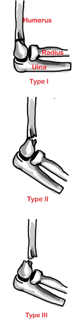

---

title: Elbow Injuries - Supracondylar Fractures Extension
authors:
    - Melody Glenn, MD
    - Andrew Little, DO
    - Mary Haas, MD
created: 2016/12/12
updates: null
categories:
    - Peer Reviewed
    - Orthopedics

---

# Elbow Injuries: Supracondylar Fractures Extension

## X-ray views

- **Elbow:** AP and lateral.
- **Forearm:** AP and lateral.

Assess for indirect signs of fx on lateral elbow view:
- Sail sign or posterior fat pad.
- Anterior humeral line no longer intersects middle third of capitellum.

## Acute Management

Long arm posterior splint in position of comfort.

## Follow Up Timing

**Non-displaced fracture:** Urgent orthopedic follow-up in &le;2 days.
**Displaced fracture:** Hospital admission for serial neurovascular exams and operative stabilization.

## Notes

### Classifications

- **Type I:** Non-displaced/
- **Type II:** Displaced with intact posterior cortex.
- **Type III:** Complete displacement (both anterior and posterior cortex).

### Complications

- Median (anterior interosseous nerve branch), ulnar, or radial nerve injury.
- Malunion causing deformity, Volkmann contracture.

Extension more common in children.

## References

- [Wheeless’ Textbook of Orthopaedics] (http://Wheelessonline.com)
- [Orthobullets] (http://OrthoBullets.com)
- [Radiopaedia] (http://Radiopaedia.org)
- General Guidelines For Management for Orthopedic Injuries card by the Nationwide Children’s Hospital, Dept of Orthopedics.
