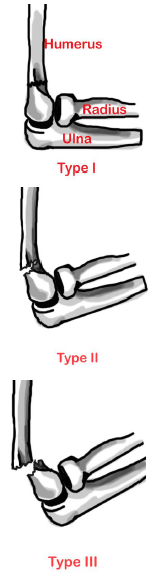

# Elbow Injuries: Supracondylar Fracture Flexion

## X-ray Views

**Elbow:** AP and lateral.
**Forearm:** AP and lateral.

## Acute Management

Long arm posterior splint in position of comfort.

## Follow-up Timing

**Type I:** Orthopedic follow up in &le;7 days
**Displaced fracture:** Consult orthopedicsurgeon to discuss, because no evidence on best treatment plan for adults and children (closed reduction plus immobilization vs operative).

## Notes

### Classifications
- **Type I:** Non-displaced.
- **Type II:** Displaced with intact anterior cortex.
- **Type III:** Complete displacement (both anterior and posterior cortex).

Flexion type (compared to extension) more likely to need operative repair in children.

**Complications:** Ulnar nerve entrapment and injury.

Less common overall, more common in adults.

## References

- Wheeless’ Textbook of Orthopaedics. Available at: http://www.wheelessonline.com/ortho/pediatric_supracondylar_fractures_of_the_humerus. Accessed August 1, 2017.
- Orthobullets. Available at: http://www.orthobullets.com/pediatrics/4007/supracondylar-fracture--pediatric. Accessed August 1, 2017.
- Radiopaedia. Available at: http://radiopaedia.org/articles/supracondylar-fracture. Accessed August 1, 2017.
- General Guidelines For Management for Orthopedic Injuries card by the Nationwide Children’s Hospital, Dept of Orthopedics.