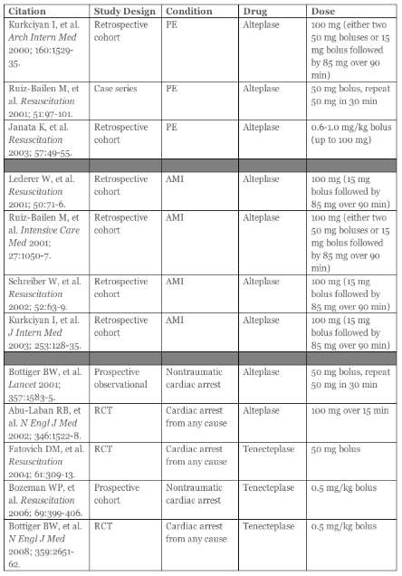

---

title: tPA Code Dose
authors:
    - Bryan D. Hayes, PharmD
created: 2013/05/14
updates: null
categories:
    - Critical Care
---

# tPA: Code Dose of tPA

**Clinical Question: **In the rare situation where fibrinolytics may be indicated in cardiac arrest from PE or Acute Myocardial Infarction (AMI), what’s the dose?

**Take Home Points**

- The dose of **tPA** in cardiac arrest is somewhere between **50-100 mg** given as a bolus +/- infusion.
- According to the [2010 AHA Guidelines for Cardiopulmonary Resuscitation and Emergency Cardiovascular Care](http://circ.ahajournals.org/content/122/18_suppl_3/S729.full), “Ongoing CPR is not an absolute contraindication for fibrinolysis.”
- Some studies suggest allowing 15 minutes of CPR for drug to work.
- Evidence is ‘best’ for PE; data does not support for undifferentiated cardiac arrest.
- Anticoagulants, such as heparin, were used in most studies along with the fibrinolytic.

## References

- [Neumar RW, Otto CW, Link MS, Kronick SL, Shuster M, Callaway CW, Kudenchuk PJ, Ornato JP, McNally B, Silvers SM, Passman RS, White RD, Hess EP, Tang W, Davis D, Sinz E, Morrison LJ. Part 8: adult advanced cardiovascular life support: 2010 American Heart Association Guidelines for Cardiopulmonary Resuscitation and Emergency Cardiovascular Care.Circulation. 2010 Nov 2;122(18 Suppl 3):S729-67](http://circ.ahajournals.org/content/122/18_suppl_3/S729.full)

Click [here](https://www.aliem.com/2013/whats-code-dose-of-tpa/) for full ALiEM blog post
