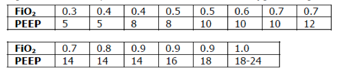

# Ventilator Setting for Lung Protection

**Lung protection:** Strategy for patients with lung injury and those prone to lung injury. This applies to every intubated patient **except** those with acute asthma/COPD.

Initial ventilator setting for patient with predicted body wt = 70 kg (5'9" male; 5'11" female)

<table>
<colgroup>
<col width="50%" />
<col width="50%" />
</colgroup>
<tbody>
<tr class="odd">
<td><ul>
<li>Mode = Volume Assist Control (AC) 
</li>
<li>Tidal volume = 350-560 mL 
</li>
<li>Inspiratory flow rate = 60 L/min 
</li>
<li>Respiratory rate = 16 
</li>
</ul></td>
<td><ul>
<li>FiO2 = 100% 
</li>
<li>PEEP = 5 
</li>
<li>Goal plateau P &lt;30 cmH2O 
</li>
</ul></td>
</tr>
</tbody>
</table>

## Ventilator Mode

Volume Assist Control (AC)

## Tidal Volume (Vt)

6-8 mL/kg (LUNG PROTECTION)

- Based on predicted body weight (kg)
- If acute lung injury (ALI) or ARDS present, goal is to bring down to 6 mL/kg
- Do NOT alter to fix ventilation, but may need to alter if plateau pressure is > 30 cmH2O, see below). Only protects lung by preventing barotrauma.

## Inspiratory Flow Rate (IFR)

60-80 L/min (PATIENT COMFORT)

- Increase IFR and ensure adequate sedation if patient uncomfortable or sucking on tube

## Respiratory rate (RR)

Start at 16-18, then adjust based on pCO2 (VENTILATION)

- Goal pH = 7.30 - 7.45
- Goal pCO2 = mild hypercarbia

## FiO2 & PEEP

Start at FiO2 100% and PEEP 5 (OXYGENATION)

- Goal PaO2=55-80 or SpO2=88-95%
- Wait 5-15 min, then draw an ABG
- If ABG and SpO2 show adequate oxygenation, drop FiO2 to 30-40% and begin titrating FiO2 and PEEP per the chart below to achieve oxygenation goal.

[EMCrit.org](http://www.EMCrit.org)

## Plateau Pressure (Pplt)

- Goal Pplt &lt;30 cmH2O
- Check after initial settings, and at regular intervals thereafter
- Technique: Press inspiratory hold button for 0.5 sec and look at pressure gauge
- If Pplt >30 cmH2O, lower Vt until you acheive your goal
- May need to go as low as 4 mL/kg of predicted body weight

## References

- NHLBI ARDS Network, "Ventilator Protocol Card" [Link](http://www.ardsnet.org/node/77791)
- Ventilation with lower tidal volumes as compared with traditional tidal volumes for acute lung injury and the acute respiratory distress syndrome. The Acute Respiratory Distress Syndrome Network. N Engl J Med. 2000 May 4;342(18):1301-8. [PubMed](https://www.ncbi.nlm.nih.gov/pubmed/10793162)
